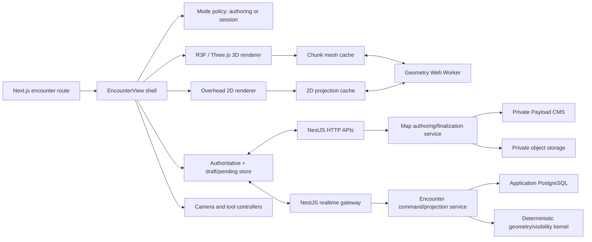

# Encounter View: Business Requirements and Technical Design

| Field | Value |
| --- | --- |
| Status | Proposed |
| Owners | Product and application teams |
| Last updated | 2026-07-20 |
| Target | Incremental delivery beginning with encounter-map authoring and read-only session rendering |
| Related design | [Realtime multiplayer and collaboration transport](./realtime-multiplayer-design.md) |

## 1. Purpose

This document defines the product requirements and proposed technical design for an encounter view in World Building. The view becomes active when a party begins an encounter likely to involve combat. It presents a coarse-grained, textured 3D volume made from deformable voxel cells and supports two modes in one product surface:

- **Authoring mode**, where a game master (GM) creates, deforms, textures, validates, and finalizes a map before play.
- **Session mode**, where the GM and players view a finalized map, inspect encounter state, and plan actions. Players use a camera locked to their own token; the GM retains unrestricted camera control.

Encounter actions are resolved by a separate plan/execute/reconcile engine. This design provides the spatial model, presentation, visibility, persistence, and integration boundaries that engine needs; it does not define combat rules or simultaneous action resolution.

## 2. Product context

The current application consists of:

- a Next.js 16 and React 19 frontend;
- a NestJS 10 public backend and future realtime gateway;
- application PostgreSQL for mutable runtime and coordination state;
- a private Payload CMS and private S3-compatible object store for authored content and media; and
- Auth0-authenticated browser and API routes.

The encounter view must extend these boundaries. Browser code must not call Payload directly. Authored map records and artifacts are reached through NestJS, and mutable session state remains outside Payload. Realtime commands and recipient-specific state use the transport defined in the related realtime design.

## 3. Terminology

| Term | Meaning |
| --- | --- |
| Encounter map | Authored spatial content associated with a campaign encounter and optionally linked to a world location. |
| Map draft | Mutable authoring state that has not been finalized for play. |
| Map revision | Immutable finalized snapshot of a map and its compiled artifacts. |
| Encounter instance | Runtime use of one finalized map revision in a game session. |
| Cell | One addressable position in the maximum 100 × 100 × 100 logical volume. “Voxel” and “cell” are equivalent in product language. |
| Shared vertex | A lattice point referenced by every adjacent occupied cell, so an edit cannot create cracks between those cells. |
| Face material | A system-palette texture/material assignment associated with a logical cell face. |
| Token | A character or encounter entity rendered as a 3D model or camera-facing billboard. |
| Visible now | A token or region that currently passes server-authoritative line-of-sight and visibility rules. This is distinct from an explicitly invisible token. |
| Fog of war | The player-specific presentation and state that obscures areas not presently visible and, subject to an unresolved product choice, areas not previously explored. |

# Part I: Business requirements

## 4. Business objective

Provide a reusable encounter surface that lets a GM prepare tactically legible, location-linked battle spaces without requiring 3D-modeling expertise, and lets distributed players understand and plan movement in those spaces from their characters' perspectives.

The feature succeeds when a GM can quickly create and finalize a map, players can enter an encounter without receiving information their tokens cannot perceive, and all participants see a consistent outcome after each plan/execute/reconcile cycle.

## 5. Personas and needs

### 5.1 Game master

The GM needs to:

- author coarse terrain quickly rather than operate a general-purpose modeling tool;
- control map scale and understand measurements at authoring time;
- deform cells into simple useful shapes such as ramps;
- assign recognizable surface materials;
- undo mistakes, inspect/debug the serialized result, and finalize a valid revision;
- connect a map to a campaign encounter and optionally a world location;
- see the entire map and all tokens during a session; and
- rotate, pan, and zoom in both authoring and session modes.

### 5.2 Player

The player needs to:

- understand terrain and token positions from a third-person view centered on their token;
- rotate and zoom without moving the camera target away from their token;
- switch to an overhead 2D presentation when preferred;
- see only tokens for which their controlled token has line of sight; and
- plan a directed move from one position to another without directly driving the token in real time.

### 5.3 Application operator/developer

The operator or developer needs deterministic map data, inspectable exports, bounded resource use, reproducible compiled artifacts, metrics for rendering and visibility, and resumable sessions without exposing CMS infrastructure or hidden player information.

## 6. Scope

### 6.1 MVP

- Sparse encounter maps within a maximum logical volume of 100 × 100 × 100 cells.
- GM-selected map scale between 6 inches and 5 feet per cell.
- Add/remove cells through direct face interaction and deform terrain through shared-vertex toggles.
- Shared vertex behavior that prevents cracks between adjacent cells.
- Assign a system-palette material to each logical face.
- Required material support for grass, rock, water, sand, dirt, and road; the exact launch palette is a product/configuration decision.
- Undo and redo for authoring commands.
- Debug export of canonical map data and format/version metadata.
- Finalization into an immutable map revision.
- 3D session rendering with 3D-model and billboard tokens.
- GM orbit, pan, and zoom controls.
- Player third-person camera locked to the player's token, with rotation and zoom but no pan or retargeting.
- Player-selectable overhead 2D mode and automatic reduced-capability fallback.
- Server-authoritative line of sight and fog of war.
- Recipient filtering that entirely omits tokens a player cannot currently see.
- Integration points for directed movement plans and reconciled results.
- Persistence sufficient to resume an interrupted game session.

### 6.2 Post-MVP requirements

- Additional lighting and environmental presentation.
- Explicit invisible/hidden token rules separate from ordinary lack of line of sight.
- GM-only annotations and reveal controls.
- Additional deformation presets proven useful in play.
- Efficient texture blending at material boundaries if the visual and performance spike succeeds.
- Optional efficient water animation.
- Procedural terrain generation with deterministic seeds and an undoable preview/apply workflow.
- Higher fidelity token animation and effects.
- Precomputed low-detail or thumbnail map derivatives.

### 6.3 Non-goals

- A general-purpose 3D modeling tool.
- Sculpting arbitrary meshes or importing arbitrary terrain topology in the MVP.
- Direct, action-game-style player movement.
- Editing a map revision while it is in use by an active encounter instance.
- Defining initiative, combat math, collision outcomes, or the plan/execute/reconcile rules engine.
- Persisting transient encounter state as reusable authored state across campaigns.
- Sending private Payload or object-storage credentials to the browser.

## 7. Functional requirements

### 7.1 Encounter and revision lifecycle

| ID | Requirement |
| --- | --- |
| ENC-LIFE-001 | A map draft must belong to a campaign encounter and may reference a world location. |
| ENC-LIFE-002 | The GM must be able to finalize a valid draft into an immutable map revision. |
| ENC-LIFE-003 | An encounter instance must reference exactly one finalized revision for its lifetime. |
| ENC-LIFE-004 | The GM may revise the map later by creating or editing a draft and finalizing a new revision; an active instance must not change revisions in place. |
| ENC-LIFE-005 | Starting an encounter must activate the encounter view for its participants. |
| ENC-LIFE-006 | Interrupted sessions must restore the encounter instance, plan/execute/reconcile phase, token state, visibility inputs, and the referenced map revision. |

### 7.2 Map authoring

| ID | Requirement |
| --- | --- |
| ENC-AUTH-001 | The address space must not exceed 100 cells on any axis. Empty cells must not require stored cell records. |
| ENC-AUTH-002 | In place mode, the GM must be able to add a cube adjacent to a highlighted face with click/touch, drag across faces to build an X/Y surface, and remove a cube by right-clicking one of its faces. |
| ENC-AUTH-003 | In shape mode, the nearest editable shared vertex must highlight as the pointer approaches, and click/touch must toggle that vertex between its full-height and collapsed-height positions. |
| ENC-AUTH-004 | A deformation must update shared geometry consistently so adjacent occupied cells do not develop cracks. |
| ENC-AUTH-005 | In texture mode, the GM must be able to apply the current system-palette texture by clicking/touching a highlighted non-degenerate face without choosing a compass-oriented face name. |
| ENC-AUTH-006 | Water surfaces must have a dedicated material type and valid surface semantics. Animation is optional. |
| ENC-AUTH-007 | Every authoring mutation must be undoable and redoable within the current editing session. |
| ENC-AUTH-008 | Debug export must include format version, bounds, scale, sparse geometry, face assignments, palette version, and enough information to reproduce the map. |
| ENC-AUTH-009 | Finalization must reject invalid topology, out-of-range coordinates, unresolved material IDs, inconsistent shared vertices, and unsupported format versions. |
| ENC-AUTH-010 | A procedural generator, when added, must use an explicit seed, show a preview, and apply its result as one undoable authoring transaction. |
| ENC-AUTH-011 | A newly created empty map must initialize as a 10 × 10 plane of cubes at the Z origin using the current remembered texture, defaulting to dirt. |
| ENC-AUTH-012 | The authoring canvas must occupy the full available width and most of the viewport height, with place, shape, texture, current-texture, validate, save, release, and export controls in a compact row above it. |

### 7.3 Scale and measurement

| ID | Requirement |
| --- | --- |
| ENC-SCALE-001 | A finalized revision must store an immutable physical length per cell between 6 inches and 5 feet inclusive. |
| ENC-SCALE-002 | Rendering must use normalized scene units and must not lose precision when the physical scale changes. |
| ENC-SCALE-003 | Measurements presented to users and plan inputs must convert through the revision's scale rather than embedding a five-foot-grid assumption. |
| ENC-SCALE-004 | Token dimensions and movement inputs must use canonical physical units at API boundaries. |

Whether the GM chooses any value in the supported range or chooses from a discrete preset list remains an open product decision; see section 22.

### 7.4 Camera and presentation

| ID | Requirement |
| --- | --- |
| ENC-VIEW-001 | The GM must be able to rotate, pan, and zoom in both authoring and session modes. |
| ENC-VIEW-002 | In 3D session mode, a player's camera target must remain their token. The player may orbit and zoom but must not pan or retarget another token. |
| ENC-VIEW-003 | Player camera controls must prevent routine terrain clipping and must recover when reconciled movement places the token near or inside obstructing geometry. |
| ENC-VIEW-004 | Players must be able to switch between 3D and overhead 2D views without changing encounter state or visibility rules. |
| ENC-VIEW-005 | Overhead player view must remain centered on the player's token and permit rotation and zoom but not pan. |
| ENC-VIEW-006 | A capability check must select 3D, reduced-quality 3D, or 2D fallback without blocking encounter participation. |
| ENC-VIEW-007 | Billboard tokens must rotate visually toward the active camera without changing their authoritative world orientation. |
| ENC-VIEW-008 | The same encounter snapshot must drive 3D and 2D presentations. Switching views must not fetch a less restrictive projection. |

### 7.5 Visibility and fog of war

| ID | Requirement |
| --- | --- |
| ENC-VIS-001 | NestJS must authoritatively calculate or validate each player's current token-visibility set. |
| ENC-VIS-002 | A player projection must omit a token entirely when the player's token lacks line of sight to it. Client-side hiding alone is prohibited. |
| ENC-VIS-003 | GM projections must include all encounter tokens unless a future capability policy explicitly restricts them. |
| ENC-VIS-004 | Line of sight must be derived from canonical map geometry and token perception/occlusion inputs, not from the viewing camera. |
| ENC-VIS-005 | Visibility must be recomputed after reconciled movement or any other authoritative change that can affect occlusion. |
| ENC-VIS-006 | 3D and 2D views must use the same server-issued visibility revision. |
| ENC-VIS-007 | The UI must distinguish “not received/not visible” from future explicit invisibility rules; it must not infer why an entity is absent. |
| ENC-VIS-008 | Fog state required for interrupted-session recovery must be durable according to the selected exploration policy. |

### 7.6 Planning integration

| ID | Requirement |
| --- | --- |
| ENC-PLAN-001 | Player interaction must create a directed movement intent rather than directly mutate authoritative token position. |
| ENC-PLAN-002 | A planned path and destination may be rendered as pending information visible only to authorized recipients. |
| ENC-PLAN-003 | Reconciled token movement must animate from the prior authoritative state to the new one without changing the authoritative event order. |
| ENC-PLAN-004 | A rejected or altered plan must provide a stable reason/result contract that the encounter view can present. |
| ENC-PLAN-005 | Visibility changes are applied from the reconciled state, not predicted in a way that exposes hidden tokens. |

## 8. Business rules

1. A finalized map revision is immutable.
2. An active encounter instance cannot be edited in authoring mode and cannot silently adopt a newer revision.
3. Only an authorized GM can mutate or finalize a draft.
4. A player can control the camera target and submit plans only for tokens allowed by session capabilities.
5. Player visibility is based on token perception, never on camera placement.
6. Hidden token data is filtered before serialization to the player.
7. Scale is authored once per revision and is not changed by zoom.
8. Empty space is absence, not a million serialized empty-cell records.

## 9. Non-functional requirements

### 9.1 Performance budgets

These are initial acceptance targets, not claims about unmeasured capacity:

- Maintain 30 frames per second at the supported low-end 3D profile and target 60 frames per second on the reference desktop profile during ordinary camera movement.
- Keep ordinary camera input response below 100 ms at the 95th percentile on reference hardware.
- Show a useful 2D or coarse 3D view within 3 seconds after the authenticated map manifest is available on a representative broadband connection; progressively load higher-quality token assets.
- Apply a local authoring edit and update affected geometry within 100 ms at the 95th percentile for representative maps.
- Keep routine reconciled-state-to-visible-update latency within the realtime transport budget.
- Establish explicit maximum occupied-cell, exposed-triangle, chunk, material, token, and artifact-byte budgets through a benchmark corpus before production launch.

### 9.2 Reliability and recovery

- Canonical map serialization and compiled artifacts must be versioned and checksummed.
- Finalization must be idempotent for the same draft version and command ID.
- Durable encounter events must follow the ordering, replay, and snapshot requirements in the realtime design.
- A client that loses graphics context must be able to reconstruct presentation from the current authoritative snapshot.
- Missing optional textures or models must fall back visibly without making the encounter unusable.

### 9.3 Security and privacy

- NestJS remains the browser-facing authorization and projection boundary.
- Payload, the CMS database, and private object storage remain inaccessible directly from the browser.
- Signed or authenticated asset delivery must preserve workspace/campaign/session authorization.
- Map import/export parsers must enforce size, coordinate, version, and identifier limits.
- Hidden tokens, GM annotations, future invisible entities, and private plans must never be broadcast for client-side filtering.
- Fog rendering alone is not a confidentiality control for terrain already downloaded; the unresolved terrain-secrecy requirement must be settled before claiming otherwise.

### 9.4 Accessibility

- All authoring tools and session controls require keyboard-operable equivalents.
- Tool state, selection, errors, scale, measurements, camera mode, and connection status must have non-color indicators and accessible text.
- The overhead 2D view must support accessible token lists and plan summaries; the 3D canvas cannot be the only way to inspect actionable encounter state.
- Motion reduction must shorten or remove decorative camera and token interpolation without changing results.

# Part II: Technical design

## 10. Technology choice

Use **Three.js through React Three Fiber**, with selected `@react-three/drei` helpers, inside a client-only encounter renderer.

Reasons:

- It fits the existing React component architecture while retaining direct access to Three.js geometry, materials, ray casting, cameras, and rendering diagnostics.
- React Three Fiber supports on-demand rendering, asset reuse, instancing, adaptive device performance, and React's scheduling model. Its performance guidance explicitly recommends minimizing draw calls, reusing resources, and using instancing where appropriate ([React Three Fiber performance guidance](https://r3f.docs.pmnd.rs/advanced/scaling-performance)).
- Three.js documents a chunked voxel-meshing approach that emits only exposed faces instead of creating one mesh per voxel, including rebuilding adjacent chunks after boundary edits ([Three.js voxel geometry guide](https://threejs.org/manual/en/voxel-geometry)).
- `BufferGeometry` provides the indexed position, normal, UV, and custom attributes needed for generated chunk meshes ([Three.js BufferGeometry](https://threejs.org/docs/pages/BufferGeometry.html)).

Start production with Three.js `WebGLRenderer` on WebGL 2. The current Three.js documentation describes `WebGPURenderer` as capable of falling back to WebGL 2, but its migration guide still calls it experimental and notes material/post-processing incompatibilities. Treat WebGPU/TSL as a measured later migration, not an MVP dependency ([Three.js WebGPU renderer guide](https://threejs.org/manual/en/webgpurenderer)).

Do not render one React component or one Three.js mesh per occupied cell. React owns the encounter shell and declarative lifecycle; a geometry service owns typed arrays, chunk rebuilds, and renderer resources.

## 11. Component and service architecture



### 11.1 Frontend boundaries

`EncounterView` is one shell with explicit policies, not a component full of role conditionals:

```ts
type EncounterViewMode =
  | { kind: 'authoring'; draftId: string; capabilities: AuthoringCapabilities }
  | { kind: 'session'; sessionId: string; encounterInstanceId: string; capabilities: SessionCapabilities };
```

The shell composes:

- `EncounterScene`: canonical scene adapter shared by 3D and 2D presentations.
- `MapChunkRenderer`: generated terrain meshes and material resources.
- `TokenRenderer`: GLTF models, billboards, selection rings, and reconciled interpolation.
- `GmCameraController`: orbit, pan, and zoom.
- `PlayerCameraController`: token-targeted orbit and zoom with pan/retarget disabled.
- `AuthoringToolbar`: cell, deformation, face-paint, undo/redo, validation, export, and finalize operations.
- `PlanOverlay`: directed paths, destinations, phase state, and reconcile results.
- `VisibilityLayer`: consumes already-filtered entities plus fog masks; it does not grant visibility.
- `EncounterAccessibilityPanel`: structured token, plan, measurement, and status representation.

The session realtime provider lives above the route's renderer so changing between 3D and 2D does not reconnect or create a second domain store.

### 11.2 Shared deterministic geometry package

The Phase 0 implementation uses the shared workspace package `packages/common`, with no DOM, React, Three.js, Payload, or NestJS dependencies. It owns:

- canonical format types and validation;
- shared-vertex normalization;
- topology validation;
- exposed-face extraction and triangulation;
- coordinate and physical-unit conversion;
- conservative collision/occlusion primitives;
- voxel/chunk traversal and line-of-sight queries; and
- stable checksums/test fixtures.

The browser worker uses it to build render buffers. NestJS uses the same version to validate finalization and compute visibility. Three.js-specific buffer/material creation remains in the frontend.

## 12. Geometry model

### 12.1 Why the input notation needs normalization

The conceptual notation supplied for the feature is:

```json
{
  "cube": { "top": [1, 1, 1, 1], "bottom": [1, 1, 1, 1] },
  "ramp": { "top": [1, 0, 0, 1], "bottom": [1, 1, 1, 1] }
}
```

It communicates intent well: an edge at `1` has full length and an edge at `0` has zero length. It is not sufficient as the canonical storage format because independently stored cell arrays can disagree at shared corners, edge-length combinations can describe impossible solids, and zero-length edges create coincident vertices that need deterministic triangulation.

### 12.2 Recommended canonical representation: shared vertex remaps

Model the undeformed volume as an integer lattice. An occupied cell references the eight lattice vertices at its corners. Identity references produce a full cube. A deformation collapses one lattice vertex onto an axis-adjacent lattice vertex; a zero-length edge is therefore represented by both endpoints resolving to the same canonical vertex.

```ts
type LatticePoint = readonly [x: number, y: number, z: number]; // each 0..100

interface SparseMapGeometryV1 {
  formatVersion: 'encounter-map/1';
  scaleInFeet: 0.5 | 1 | 5;
  paletteVersion: string;
  bounds: { min: LatticePoint; max: LatticePoint };
  occupiedCells: Array<{
    x: number;
    y: number;
    z: number;
    materials?: Partial<Record<LogicalFaceId, string>>;
  }>;
  vertexRemaps: Array<{
    from: LatticePoint;
    to: LatticePoint;
  }>;
}
```

Unchanged vertices and empty cells are omitted. Canonical occupancy is a sorted sparse list; fixed-size chunks are a compiler/runtime artifact rather than part of the versioned source format. Adjacent cells inherently reference the same lattice point; resolving that point through the same remap guarantees that a shared corner moves together. Remaps must be local, acyclic, canonicalized, and limited to a reviewed deformation vocabulary.

The normal authoring UI manipulates this representation directly through highlighted shared vertices: selecting a vertex toggles its full-height/collapsed-height remap. Named presets may remain useful for procedural generation, import tooling, or keyboard accelerators, but the primary GM workflow must not require understanding internal ramp-orientation identifiers or compass-oriented face names.

This representation is a **proposal requiring a geometry spike**, not a claim that every possible top/bottom bit pattern is valid. Phase 0 must render and validate all ramp orientations, side-by-side ramps, stacked cells, inside/outside chunk boundaries, material assignment, and degenerate cases. Patterns that self-intersect, invert triangles, create non-manifold surfaces, or force incompatible neighboring remaps must be rejected with a useful authoring error.

### 12.3 Cell and face identity

Cells use integer `(x, y, z)` addresses and are grouped into sparse chunks. Logical faces retain stable semantic IDs (`top`, `bottom`, `north`, `east`, `south`, `west`) even when triangulated. A collapsed zero-area face emits no triangles but retains no material requirement. Triangulation winding and the diagonal used for non-planar quads must be deterministic and format-versioned.

### 12.4 Chunking and meshing

- Partition occupied space into fixed-size chunks; begin the benchmark with 16 × 16 × 16 cells, but make chunk size an artifact compiler parameter rather than a public format guarantee.
- Store occupancy as a bitset or run-length encoded sparse data inside existing chunks.
- Build indexed `BufferGeometry` per visible chunk, emitting only exposed triangles.
- When an authoring edit touches a chunk boundary, rebuild the affected chunk and neighboring chunks whose exposed faces or shared vertices changed.
- Generate render buffers in a Web Worker and transfer typed-array ownership to the main thread.
- Cache compiled artifacts by canonical map checksum, compiler version, palette version, and quality profile.
- Frustum-cull chunks and use distance-based detail for token models. Do not use individual cube meshes.

Greedy meshing can merge coplanar, identically materialed full faces. Deformed faces require conservative merging rules. Correct topology takes priority over maximum merging.

## 13. Materials, textures, and water

### 13.1 System palette

Each palette entry has a stable ID and versioned render metadata. Palette assets are private authored media served through the existing NestJS-controlled asset path. A face stores a palette material ID, never an arbitrary browser URL.

```ts
interface EncounterMaterialDefinition {
  id: string;
  version: number;
  kind: 'solid' | 'water';
  colorMapAssetId: string;
  normalMapAssetId?: string;
  roughnessMapAssetId?: string;
  physicalTileSize: { value: number; unit: 'in' };
  fallbackColor: string;
}
```

Use texture arrays or a carefully padded atlas after measuring target-device support and draw calls. UV scale derives from physical size so grass or road does not visibly change density when a GM selects a different cell scale.

### 13.2 Boundary blending exploration

Texture blending is post-MVP unless the spike proves it cheap enough for the launch profile. Evaluate, in order:

1. no blend, with deterministic face boundaries;
2. a narrow geometry/material blend strip at coplanar boundaries;
3. per-vertex material weights with a limited two-material shader; and
4. triplanar blending only if slopes and texture distortion justify its cost.

The compiler must cap materials per triangle/chunk and provide a lower-quality non-blended path. Blending must not change collision or line-of-sight geometry.

### 13.3 Water

Water is a material semantic, not merely a blue texture. For MVP it may be a transparent or opaque static surface with a distinct fallback color and render ordering. The map validator must define which face orientations may be water and how adjoining water faces join. Optional animation may use a low-cost normal/UV offset and must honor reduced-motion and reduced-quality settings. Water physics and movement costs belong to the rules/planning layer.

## 14. Authoring interaction design

The canvas is the primary editor and works in three explicit modes selected above the map:

1. **Place:** highlight the face nearest the pointer. Click or touch adds a cube adjacent to that face using the current texture. Dragging across faces creates an X/Y surface; Z-axis drag construction is deferred. Right-clicking an occupied face removes its cube.
2. **Shape:** highlight the nearest editable shared vertex. Click or touch toggles that lattice point between full and collapsed height, immediately deforming all geometry that shares it.
3. **Texture:** highlight the face nearest the pointer. Click or touch applies the current system texture to that logical face.

The current texture selector sits beside the mode selector, persists locally across authoring sessions, and defaults to dirt. Empty new drafts are initialized and saved as a 10 × 10 plane at the Z origin with that texture. Validate, save, and release actions are right-aligned in the same command bar, with debug export presented as a secondary text action. Diagnostics remain available beneath the viewport but must not compete with the map for space.

Camera gestures are separated from edits: primary pointer/touch input edits, middle-drag rotates on desktop, two-finger touch controls the camera on mobile, and wheel/pinch zooms. Keyboard commands must cover tool choice, camera orientation, apply, undo, and redo.

Every mutation is an intent command with an inverse or before-image:

```ts
type MapEditCommand =
  | { type: 'cell.set'; at: CellAddress; occupied: boolean }
  | { type: 'vertex.toggle'; at: LatticePoint }
  | { type: 'face.material.set'; face: LogicalFaceId; materialId: string }
  | { type: 'generator.apply'; seed: string; generator: string; parameters: unknown };
```

Undo/redo history is local to the draft editing session in the MVP, with periodic draft saves of canonical state and an optimistic draft version. Finalization operates on a saved draft version, not unsaved local history. A conflicting/stale save fails rather than silently merging structured geometry.

Debug export is a JSON envelope containing canonical data, checksums, validation results, and optional compiler statistics. It must exclude credentials, signed URLs, and unrelated campaign content.

## 15. Camera and token rendering

### 15.1 GM camera

Use orbit controls with enabled pan, rotate, and zoom, bounded to useful map distances. Authoring selection should preserve the camera position. Session mode may offer “frame selected token” as a convenience without restricting later movement.

### 15.2 Player 3D camera

The camera target is derived solely from the authoritative controlled-token transform plus a presentation offset. User input changes yaw, pitch within configured limits, and distance. Pan and target-changing APIs are disabled in the controller, not merely hidden in the UI.

A ray/capsule test between target and proposed camera position should shorten the camera distance when terrain occludes the token. After reconciled token movement, smoothly move the target unless reduced motion is enabled or the displacement is too large, in which case snap predictably.

### 15.3 Overhead 2D

The preferred 2D mode uses a simplified orthographic projection of canonical chunk geometry so rotation, scale, fog, and token positions remain consistent. A Canvas 2D/raster-tile fallback must be available if WebGL 2 initialization fails or the adaptive performance floor is missed. Player 2D controls retain the token-centered no-pan policy; GM 2D controls allow pan.

### 15.4 Tokens

- 3D tokens use validated, bounded GLTF/GLB assets with a low-detail fallback.
- Billboard tokens use character art on camera-facing quads; billboarding is renderer-only and never changes authoritative heading.
- Missing or failed assets render a labeled primitive with the token's permitted public identity.
- Token transform state uses canonical physical coordinates and explicit orientation; presentation converts it to normalized scene units.

## 16. Line of sight and fog of war

### 16.1 Authority model

Visibility is computed from encounter state on the server at authoritative state boundaries, especially after reconcile. Camera rotation does not affect perception. The result is a monotonically versioned visibility projection per participant or controlled perception source.

The server may send terrain geometry required to render the map, but it sends only currently visible token DTOs. When a token leaves visibility, the event removes it from that recipient's store. It does not send an entity with `visible: false`.

### 16.2 Geometry algorithm

The initial deterministic implementation should:

1. derive one or more eye/sample points from the perceiving token contract;
2. derive bounded sample points on candidate target volumes;
3. traverse sparse chunks and occupied cells with a 3D DDA or equivalent broad phase;
4. intersect only candidate generated triangles or conservative occluder primitives;
5. classify visibility using a versioned rule such as “any required sample ray is unobstructed”; and
6. record geometry revision, algorithm version, and visibility revision for reproducibility.

The exact eye height, target sampling, touching-edge tolerance, partial cover behavior, and interaction with future perception rules are inputs from the rules engine and remain outside this document. The geometry kernel must use fixed tolerances and deterministic tests. Benchmark a precomputed BVH only if sparse traversal is insufficient.

### 16.3 Fog representation

Fog consumes the visibility projection and canonical spatial cells/regions. It must not be inferred from which triangles happen to be on screen. The design supports both policies without choosing between them prematurely:

- **Current visibility only:** all non-visible space is obscured again.
- **Exploration memory:** previously seen terrain remains dimly visible while currently unseen tokens remain absent.

The chosen policy also needs a scope: per token, per player, or shared party. Persist only the fog/exploration state required by that choice and interrupted-session recovery.

## 17. Persistence model

### 17.1 Authored content in Payload and object storage

Payload stores metadata and relationships for:

| Record | Important fields |
| --- | --- |
| `EncounterMap` | workspace, campaign encounter, optional location, name, current draft/revision references |
| `EncounterMapDraft` | map, draft version, scale, bounds, palette version, canonical artifact reference, validation state |
| `EncounterMapRevision` | map, immutable revision number, scale, bounds, canonical checksum, compiler version, compiled artifact references, finalizedBy/At |

Large canonical and compiled map artifacts belong in private object storage rather than large Payload JSON columns. Payload stores checksums, sizes, MIME/content types, and private media relationships. Browser access continues through NestJS.

Implementing these records is a Payload model change and therefore requires a checked-in Payload migration, regenerated Payload/schema types, literal unconditional `push: false`, clean-database migration verification, and migration-status verification under repository policy.

### 17.2 Runtime state in application PostgreSQL

| Entity | Important fields |
| --- | --- |
| `EncounterInstance` | id, gameSessionId, encounter definition ID, map revision ID/checksum, status, phase, version, createdAt, updatedAt |
| `EncounterTokenState` | instanceId, tokenId, controller IDs, transform, representation reference, runtime attributes, version |
| `EncounterVisibilityState` | instanceId, participant/source ID, visibility revision, algorithm version, current set or compact mask, optional exploration state |
| `EncounterPlan` | instanceId, cycle, actor/controller, private plan payload, status, version |
| `EncounterEvent` | existing session ordering fields plus encounter instance, cycle, visibility classification, command ID |
| `EncounterSnapshot` | instanceId, through sequence/cycle, resumable projection, map revision checksum, createdAt |

These are mutable runtime/coordination records and must not be stored in Payload. Use checked-in TypeORM migrations with `synchronize: false` when implemented.

## 18. API and realtime contracts

### 18.1 HTTP

Proposed endpoints, all authenticated and capability checked:

Route convention: routes are anchored at the owning aggregate and identify child resources via path parameters. For encounter APIs, definition/artifact routes are encounter-owned while runtime routes are session-owned. See the shared convention in `docs/development.md`.

Identifier naming note: use `encId` for encounter definitions and `instanceId` for session runtime encounters.

- `GET /encounters/:encId/maps/:mapId/drafts/:draftId`
- `PUT /encounters/:encId/maps/:mapId/drafts/:draftId` with expected draft version and command ID
- `POST /encounters/:encId/maps/:mapId/drafts/:draftId/validate`
- `POST /encounters/:encId/maps/:mapId/drafts/:draftId/finalize`
- `GET /encounters/:encId/maps/:mapId/revisions/:revisionId/manifest`
- `GET /encounters/:encId/maps/:mapId/revisions/:revisionId/artifacts/:artifactKind/:profile`
- `GET /sessions/:sessionId/encounters/:instanceId/snapshot`

Use HTTP for canonical/compiled encounter artifacts (maps now, additional encounter-scoped artifact families later), token models, textures, and large recovery snapshots. Use immutable cache keys based on checksums; authorization still precedes asset delivery.

### 18.2 Realtime

Extend the existing `session:<sessionId>` ordered scope initially. Candidate durable messages include:

- `encounter.started.event`
- `encounter.phase.changed.event`
- `encounter.plan.submitted.event` with recipient-filtered payload
- `encounter.reconciled.event`
- `encounter.token.changed.event`
- `encounter.token.removed-from-view.event`
- `encounter.visibility.changed.event`
- `encounter.ended.event`

Candidate ephemeral messages include selection/pointer pings and plan previews only when visibility permits. Every durable message needs schema versioning, authorization, idempotency, reducer, replay behavior, and recipient projection tests as required by the realtime design.

## 19. Performance and adaptive quality strategy

1. Fetch a small manifest first, then canonical/compiled chunks and token assets by priority.
2. Keep canonical state out of React component-per-cell structures.
3. Mesh chunks in a worker and transfer typed buffers.
4. Cull internal faces, frustum-cull chunks, share materials/textures, and cap draw calls.
5. Use on-demand rendering in authoring/static planning phases; enable continuous frames only during camera movement, interpolation, or necessary water effects.
6. Measure frame time and lower device pixel ratio, shadows, texture resolution, token LOD, blending, and water effects in that order.
7. Switch to 2D when initialization fails, the user requests it, or the performance floor remains unmet.
8. Keep LOS on the server and cache results by geometry revision and relevant token transforms; do not run visibility every render frame.

Build a representative benchmark corpus including sparse outdoor terrain, dense interior geometry, many ramps, chunk-boundary edits, worst-case exposed faces, mixed materials, water, billboards, 3D models, and maximum expected tokens.

## 20. Validation and test strategy

### 20.1 Geometry tests

- Golden fixtures for cube, four ramps, adjacent ramps, stacked geometry, all face orientations, and degenerate rejections.
- Property tests that remap resolution terminates, stays in bounds, and produces no invalid indices/NaNs.
- Shared-boundary tests proving adjacent chunks generate matching vertex positions.
- Deterministic checksum and triangulation tests across browser worker and Node runtimes.
- Round-trip canonical export/import tests for every supported format version.

### 20.2 Visibility and security tests

- Golden LOS fixtures for blocked, clear, grazing, elevated, ramp, and cross-chunk rays.
- Recipient projection tests proving unseen tokens and private plans are absent from serialized payloads.
- Reconcile tests proving visibility changes occur in authoritative order.
- Fog tests for the selected current/explored and sharing policy.
- Authorization tests across workspace, campaign, session, GM, player, and spectator boundaries.

### 20.3 UI and rendering tests

- Author each required shape/material, undo to empty, redo to the same checksum, export, finalize, and reopen.
- Verify player controls cannot pan or retarget through mouse, touch, keyboard, programmatic selection, or view switching.
- Verify GM controls in both modes.
- Compare 3D and 2D token/visibility projections.
- Test WebGL context loss, missing assets, reduced motion, keyboard workflows, and 2D fallback.
- Record frame time, draw calls, triangles, texture memory, chunk build time, and artifact load time for the benchmark corpus.

### 20.4 Recovery tests

- Disconnect during planning and after reconcile, then resume without duplicate commands.
- Restart the backend and recover through snapshot plus replay.
- Refuse to start when the referenced map artifact checksum is missing or incorrect.
- Prove a later map revision does not alter an existing encounter instance.

## 21. Delivery plan

### Phase 0: geometry and rendering spike

- Formalize shared-remap semantics and supported preset vocabulary.
- Build golden cube/ramp/neighbor/stack fixtures.
- Prototype chunk meshing, face materials, picking, water, and 3D/2D presentation.
- Compare boundary-blending techniques and establish budgets.
- Exit when the representation is deterministic, crack-free for supported shapes, and performant enough on reference hardware.

Phase 0 implementation status (current):

- Preset deformation now compiles to explicit, canonical shared-lattice remaps. Adjacent cells resolve the same lattice points, and zero-thickness/non-manifold joins are rejected instead of silently emitted.
- Supported shape vocabulary includes cube, four axis ramps, and four corner ramps.
- Scale presets are enforced at canonical-map validation: 0.5 ft, 1 ft, and 5 ft per cell.
- Canonical validation covers version, bounds, sparse occupancy, scale, palette metadata, material IDs, local/acyclic remaps, and closed two-manifold output. Canonical SHA-256 is dependency-free and identical in Node and browser workers.
- Golden fixtures cover outward winding, deterministic checksums, all supported presets, every shape-pair adjacency on all three axes, stacked cells, chunk boundaries, coincident-triangle removal, invalid topology, picking, and renderer-buffer metadata.
- Chunk output uses indexed typed position/normal/UV buffers, preserves logical face/cell/material identity, culls exact interior surfaces, and explicitly invalidates emptied chunks.
- `/encounters/spike` is a real React Three Fiber/WebGL prototype with perspective and orthographic views over the same geometry, GM-style orbit/pan/zoom, ray picking, patterned prototype textures, crisp material boundaries, static transparent water, and live FPS/frame/draw/triangle metrics.
- Crisp, non-blended material boundaries are the Phase 0/MVP baseline. Geometry strips, vertex-weight shaders, and triplanar blending remain Phase 5 candidates because they add shader/artifact complexity without changing topology.
- `pnpm --filter @world-building/common verify:phase0` runs the complete geometry suite before five-run warmed sparse and dense profiles. Timing is reported but is not enforced on arbitrary shared/CI hosts; set `ENFORCE_PHASE0_TIMING=1` on the designated reference machine. An uncontended 800-cell run on the current x64 macOS development host recorded:
   - sparse mixed presets: 16.335 ms median full mesh, 39.367 ms median chunked mesh;
   - dense cubes: 11.422 ms median full mesh, 21.533 ms median chunked mesh; and
   - full/chunked triangle-count equivalence for both profiles.

Remaining Phase 0 sign-off is an enforced timing run plus a manual run of the renderer spike on the agreed low-end and reference desktop profiles, recording its live WebGL metrics and confirming camera, picking, texture, water, and orthographic presentation visually. On 2026-07-20 the product owner explicitly deferred this reference-device sign-off and authorized Phase 1 to proceed. The deferred run remains a release gate; it is not recorded as a pass or fallback decision.

The initial mobile renderer follow-up on 2026-07-20 did not pass. A Google Pixel 9 Pro XL and a reported Samsung Galaxy Tab 12.2-inch device produced the same server-rendered geometry statistics, but the interactive region remained a gray rectangle, view changes had no visible effect, and renderer metrics remained pending indefinitely. This isolated the failure to client startup/frame production rather than canonical geometry generation. Follow-up instrumentation showed that the shell itself was not hydrating on the LAN devices because Next.js development assets were rejected for an unadmitted development origin. The frontend now explicitly admits configured LAN development origins, while production testing remains subject to the normal same-origin deployment path.

The spike now exposes three explicit modes: perspective WebGL, overhead WebGL, and a WebGL-independent SVG 2D compatibility projection. The compatibility projection and its initial state are server-rendered, so they remain visible even if application JavaScript never hydrates. A lightweight shell owns the controls, status, timeout, and SVG view; React Three Fiber and Three.js are isolated in a separately loaded optional renderer chunk so they cannot prevent the shell from hydrating. The client reports context capability separately from first-frame readiness, falls back after five seconds without a rendered frame, reports context loss, avoids indefinite metric collection, and keeps every view button retryable with `aria-pressed` state. The exact `/encounters/spike` route is exempt from Auth0 to support cross-device diagnostics; all authoring and real encounter routes remain protected. Retesting after the development-origin fix succeeded on both mobile devices: the shell hydrated, React controls responded, and the WebGL view rendered. Reference-device performance sign-off must still use a production build served with `next start`/the standalone server, not the Turbopack development/HMR runtime.

During follow-up instrumentation, an R3F `Canvas.fallback` child was briefly treated as an error callback. R3F renders that child inside the HTML canvas regardless of WebGL success, so its effect incorrectly forced every valid renderer back to SVG. Removing that side effect restored WebGL 2 rendering and live frame metrics in the local browser. Actual fallback decisions now come only from capability detection, context loss, or the no-frame watchdog.

### Phase 1: authoring vertical slice

- Add draft/revision content models, migrations, generated types, private artifacts, and NestJS APIs.
- Implement cell, shape, material, inspect, undo/redo, validation, debug export, and finalization.
- Add immutable artifact compilation and checksum verification.

Phase 1 implementation status (current):

- Payload now defines workspace-scoped encounter maps, mutable drafts, immutable revisions, and immutable private upload artifacts. The PostgreSQL adapter retains literal unconditional `push: false`.
- Checked-in migrations `20260720_013818_phase1_encounter_maps` and `20260720_013916_phase1_encounter_finalization_idempotency` add the model, per-map revision uniqueness, and idempotent finalization command IDs. Generated Payload types and PostgreSQL schema are current.
- The migrations apply successfully from an empty PostgreSQL database. Migration status reports every checked-in migration as applied, and the schema-drift verifier produces no additional migration.
- NestJS exposes encounter-owned create, load/save, validate, finalize, revision-manifest, and authorized artifact-download routes. The browser reaches these routes through the authenticated Next.js gateway and never receives Payload or object-storage credentials.
- Draft saves use optimistic versions and command IDs. Finalization validates canonical topology, compiles deterministic indexed buffers, creates an immutable revision, and records both the canonical checksum and compiler version.
- Object bytes are SHA-256 verified when read. Canonical artifacts are additionally checked against the canonical checksum recorded by the draft before they are used or finalized.
- `/encounters/author` creates an encounter-linked map and opens the dynamic, map-first draft editor. The canvas occupies the primary workspace and exposes place, shape, and texture modes with face/vertex hover feedback, click/touch editing, X/Y drag placement, right-click removal, remembered textures, undo/redo, validate/save/release, compact diagnostics, debug export, and immutable finalization. Empty first-version drafts are automatically initialized and saved as a centered 10 × 10 plane.
- `pnpm --filter @world-building/cms test:encounter-acceptance` provisions isolated workspace actors and exercises the live NestJS, private Payload CMS, PostgreSQL, and S3-compatible object-store boundary. It covers every supported shape and system material, deterministic undo/redo checksums, save and finalization idempotency, stale saves, server validation, revision reopen/download, cross-workspace concealment, revision immutability, and checksum rejection after deliberate artifact corruption.
- The live acceptance run on 2026-07-20 passed all 21 checks. It also exposed that the two checked-in Phase 1 migrations had not yet been applied to the local database; both were applied successfully, subsequent migration status showed every migration applied, and the schema-drift verifier remained clean.
- Geometry tests, focused frontend lint, frontend/backend/CMS type checks, and all three production builds pass. Repository-wide frontend lint still reports unrelated pre-existing rule-editor violations outside the encounter paths.

The Phase 1 service/content acceptance gate is complete. Remaining Phase 1 sign-off is a real Auth0 browser session through the protected Next.js gateway, manually exercising the authoring canvas, inspect controls, undo/redo, debug export, finalization, and revision reopen presentation. Once that browser journey passes, Phase 2 session read-model work can begin; failures in that journey should be treated as Phase 1 defects rather than deferred.

### Phase 2: session read model

- Add encounter runtime entities/migrations and snapshot projection.
- Render finalized terrain and billboard/primitive tokens in GM and player cameras.
- Add selectable 3D/2D views and adaptive fallback.

### Phase 3: visibility and realtime

- Implement deterministic server LOS, fog policy, recipient filtering, visibility revisions, and security tests.
- Connect session scope, reconciled token changes, reconnect, snapshot, and replay.

### Phase 4: planning integration

- Add directed movement selection and pending plan overlays.
- Consume plan/execute/reconcile outcomes and animate authoritative results.

### Phase 5: enhancements

- Procedural generation, validated texture blending, optional water animation, lighting, annotations, invisible-token rules, and expanded shapes.

## 22. Open product and technical decisions

These are intentionally unresolved rather than assumed:

1. Is scale any value between 6 inches and 5 feet, a fixed increment, or a curated preset list?
   a: 6", 1 foot, 5 feet. these need to even divisors of the default grid unit (5 ft)
2. Does fog obscure only currently unseen space, or remember explored terrain? Is exploration per token, per player, or shared by the party?
   a: fog of war fully reveals all map details within the selected token's vision and line of sight. When the token's position changes, the revealing follows the token position, but map surfaces that are no longer visible are still revealed in a dim/unknown state, but tokens that have moved out of vision or line of sight are not. exploration is tracked per-token, visible only to the token that has done the exploration
3. Must unrevealed terrain itself be confidential against browser inspection, or is visual fog sufficient while token secrecy is enforced server-side?
   a: i generally want players to not exploit this but I supposed unrevealed terrain should be confidential in the browser, unless this is prohibitively expensive.
4. Can one player control multiple tokens? If so, which token anchors the camera and whose perception defines visibility?
   a: yes, to be controlled a token must be selected, so when a new token is selected the map revealed by the previous token must be hidden (unless it overlps with the current token's vision).
5. What eye-height, target-volume, partial-cover, edge-touch, and perception rules will the plan/execute/reconcile engine supply to LOS?
   a: assume an eye-height of 5 feet, target volume is a cube the size of the token (typically 5ft square), partial cover is not necessary, I'm not sure what you mean by edge touch, unless there is an area of effect restriction on vision on the map, LOS is calculated based on the tokens default vision. Passive perception is used outside encounters.
6. Which full set of system-palette materials ships in the MVP, and who versions/publishes that palette?
   a: TBD, we need a minimal palette of: dirt, grass water, stone, wood, road, others to follow.
7. May water occupy only upward-facing surfaces, and how are shorelines or stacked water represented?
   a: not necessarily, consider the face of a waterfall, which would be represented as stacked cubes with water textured sides. where water meets shore the surface of the two materials must share the same plane
8. What maximum occupied cells, map artifact size, tokens per encounter, and simultaneous encounters must production support?
   a: An encounter can contain tens of tokens, upper limit is probably 50, there could be multiple simultaenous encounter (such as when the party splits), but only a few. 
9.  Is 2D fallback required to work without WebGL entirely, or only as a lower-cost orthographic mode on WebGL-capable devices?
    a: 2d can use whichever rendering approach is best supported on the platform.
10. How long are ended encounter instances, plans, visibility history, and snapshots retained?
    a: all that becomes obsolete when teh encounter ends (when the GM deactivates the encounter scene), however every encounter instance should have a tombstone record that includes the actual evaluated data that resulted from the encounter, which players moved when, which weapons did they use, what was the outcome, etc. This will be used to generate an AI-generated encounter summary for inclusion in a published work once the campaign is complete.
11. Which deformation patterns beyond the full cube and four simple ramps are required at launch?
    a: corner ramps (ramps that extend from a diagonal across the bottom face to a single point on any of the corners).
12. Should procedural generation create a new draft only, or may it replace an existing draft after explicit confirmation?
    a: procedural generation can replace an existing draft with confirmation.

## 23. Definition of done for the first useful release

The first useful release is complete when:

- an authorized GM can create a sparse map, add/remove cells, apply every supported ramp orientation, assign face materials including water, undo/redo, export, validate, and finalize an immutable revision;
- neighboring supported shapes render without cracks and reopen to the same canonical checksum;
- an encounter instance starts from that revision and can be resumed after interruption;
- the GM can rotate, pan, and zoom while seeing the complete authorized encounter state;
- two players can enter with token-locked cameras, rotate/zoom without panning or retargeting, and switch between 3D and overhead 2D;
- server-authoritative LOS prevents either player from receiving a token they cannot see;
- fog renders consistently in 3D and 2D according to the selected policy;
- directed movement can be submitted as a plan and a reconciled position can be applied in authoritative order;
- the representative performance corpus meets agreed device budgets or selects the 2D fallback; and
- migration, schema, authorization, recovery, geometry, visibility, and recipient-projection checks pass in CI.
