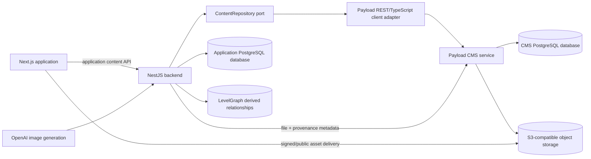

# Headless CMS Market Survey and Recommendation

| Field | Value |
| --- | --- |
| Status | CMS foundation implemented; content migration pending |
| Survey date | 2026-07-14 |
| Decision owner | Application team |
| Recommendation | Payload CMS with PostgreSQL and S3-compatible object storage; separate service required initially |

This document evaluates headless content-management systems for World Building and recommends a direction for managing large volumes of user-authored and generated content. Product capabilities and licensing change; revalidate the linked sources before implementation.

## 1. Executive recommendation

Adopt **Payload CMS** as a separately deployable Node.js content service, backed by PostgreSQL for structured content and metadata and by S3-compatible object storage for binary media.

Payload is the best match because it is TypeScript-first and explicitly code-first: collections, fields, validation, hooks, access control, admin behavior, and plugins are defined in `payload.config.ts` and collection modules. It has an official PostgreSQL adapter and code-based migration workflow, upload-enabled collections with arbitrary metadata fields, official S3-compatible storage support, generated TypeScript types, REST/GraphQL/Local APIs, versions/drafts, and an MIT-licensed self-hostable core.

Run Payload as a new `cms/` service rather than embedding it into either the existing NestJS process or the current Next.js frontend initially. NestJS remains the application's public API, authorization, AI generation, game rules, graph coordination, and future realtime boundary. Nest providers call the CMS through a narrow `ContentRepository` port backed by a Payload client. This keeps CMS-specific response shapes out of the frontend and gives the application an escape hatch if the CMS is replaced later.

Store media bytes outside PostgreSQL:

- local development: MinIO or another S3-compatible container;
- production: an S3-compatible managed object store;
- CMS/PostgreSQL: media record, ownership, relationships, purpose, tags, provenance, dimensions, MIME type, checksum, lifecycle state, and object key; and
- delivery: signed URLs or a controlled media proxy for private assets, with a CDN for public/cacheable derivatives.

The targeted proof of concept is complete. It demonstrated code-only schema changes and rollback, Auth0 identity propagation, private asset authorization, multipart generated-image ingestion, rich-text round trips, and acceptable single-machine query behavior with representative nested world content. It also identified a dependency blocker in the then-current Next.js 16.2.2/Payload 3.84 stack. Release `v0.1.1` upgraded the application frontend to Next.js 16.2.10. The separate service is now implemented with Payload 3.86.0 and Next.js 16.2.10, and the suite passes against private PostgreSQL and S3-compatible storage. See [Payload CMS proof-of-concept results](./payload-cms-poc-results.md) and [Payload CMS service implementation](./payload-cms-implementation.md).

## 2. Requirements and constraints

### 2.1 Hard requirements

- Runs on Node.js and can be self-hosted.
- Free to use and/or open source without a required hosted service.
- Headless APIs suitable for the existing Next.js frontend and NestJS backend.
- Content schemas can be defined, reviewed, tested, migrated, and deployed as code.
- PostgreSQL support and a credible migration path from the current database.
- First-class media management with extensible metadata such as purpose, tags, ownership, and provenance.
- Handles gigabytes of content by separating binary object storage from structured metadata.
- Supports application-defined authorization rather than requiring users to work only through a CMS admin UI.
- Has enough extension points for AI generation workflows, future collaboration, and domain-specific validation.

### 2.2 Strong preferences

- TypeScript types generated from content models.
- Transactional schema/data migrations stored in source control.
- REST support for straightforward NestJS integration; GraphQL is useful but not mandatory.
- Version history, drafts, soft deletion, and audit-friendly hooks.
- Storage adapters for S3-compatible services.
- Local development through Docker Compose.
- Active project and maintainable plugin surface.

### 2.3 Architectural constraint

A CMS is the system of record for authored/generated content and media metadata. It is not the system of record for every application concern. Realtime connection state, high-frequency game state, idempotency records, event journals, background job state, and ephemeral presence stay in purpose-built application storage described by the realtime design. LevelGraph may remain a derived relationship/search projection until a separate decision replaces it.

## 3. Current-state findings

The repository currently has a fragmented content system rather than a single PostgreSQL content store.

### 3.1 Structured content

- `World` is the only TypeORM content entity.
- It stores `prompt`, a text `generatedContent` description, an untyped `jsonb` `metadata` object, and `createdAt`.
- World updates replace the metadata JSON as a whole.
- TypeORM `synchronize: true` is enabled, so there is no production-safe, reviewed migration history.
- Lore relationships are also written to LevelGraph, but no durable link ties those records to a versioned CMS document.
- Campaigns and sessions are fixture data rather than persistent content models.
- Much of the editable world object is cached and updated in browser `localStorage` under `aethelgard_worlds`; this can contain content newer or richer than PostgreSQL.

### 3.2 Media

- User uploads and OpenAI-generated character images are written to `backend/data/uploads` with a UUID filename.
- A Docker named volume makes that directory persistent for the current single backend deployment.
- Files are served directly by Express under `/uploads` and proxied by Next.js API routes.
- The upload record contains no owner, world, character, purpose, tags, prompt, model, generation parameters, checksum, dimensions, alt text, licensing/source, or lifecycle state.
- URLs are embedded in world metadata or browser storage; there is no reverse relationship from a file to the content that uses it.
- Replacement and deletion can orphan files or delete a file still referenced elsewhere.
- Synchronous filesystem reads/writes and a local volume do not support multiple backend replicas or durable cloud deployment.
- Legacy `data:` images may still exist in browser storage and are migrated only opportunistically when the user opens a world.

### 3.3 Consequences

The migration inventory must include PostgreSQL, LevelGraph relationships, `backend/data/uploads`, and discoverable client-side `localStorage`. A server-side migration alone cannot recover browser-only content from users' devices. The application needs a temporary authenticated browser import flow before removing legacy storage.

## 4. Evaluation method

Candidates were scored from 1 (poor) to 5 (excellent) against the stated priorities.

| Criterion | Weight | Interpretation |
| --- | ---: | --- |
| Code-first modeling and migrations | 25% | Schema is authored/reviewed as code and production changes are reproducible |
| Media and metadata | 20% | Managed upload records, custom fields, transformations/storage adapters, authorization |
| PostgreSQL and migration fit | 15% | Official PostgreSQL support and workable import path |
| Free/open licensing | 15% | Self-hosting rights and low risk of a future mandatory license |
| API and extensibility | 10% | Headless APIs, hooks, plugins, custom endpoints, access rules |
| Stack synergy | 10% | TypeScript/Node/Next/PostgreSQL fit and Nest integration practicality |
| Maturity/operations | 5% | Active project, deployment guidance, ecosystem, maintainability |

Scores are directional, not benchmarks. A proof of concept remains necessary.

## 5. Shortlist comparison

| Candidate | Code-first | Media | PostgreSQL | License/free use | API/extensions | Stack fit | Maturity | Weighted score |
| --- | ---: | ---: | ---: | ---: | ---: | ---: | ---: | ---: |
| Payload CMS | 5 | 5 | 5 | 5 | 5 | 5 | 4 | **4.95** |
| Keystone 6 | 5 | 3 | 5 | 5 | 5 | 4 | 3 | **4.40** |
| Directus | 3 | 5 | 5 | 3 | 5 | 4 | 5 | **4.10** |
| Strapi 5 Community | 3 | 4 | 5 | 4 | 5 | 4 | 5 | **4.05** |

### 5.1 Payload CMS — recommended

**Fit**

- Payload describes itself as a config-based, code-first CMS. Its central configuration is a strongly typed `payload.config.ts`, and collection fields are TypeScript configuration.
- The official PostgreSQL adapter uses Drizzle and `node-postgres`. Payload provides migration create/status/up/down workflows; PostgreSQL migrations can include application-authored TypeScript data transformations and run transactionally.
- Any collection can be upload-enabled, and a media collection can define ordinary custom fields alongside built-in file properties. This directly supports purpose, tags, provenance, relationships, and review state.
- Official storage adapters support S3-compatible services, including Cloudflare R2, and can preserve Payload access control when files are not public.
- REST, GraphQL, and Local APIs derive from the same collections. Generated TypeScript types reduce contract drift.
- Versions and drafts are available in the core and can provide change history, diff/restore UI, and autosave where enabled.
- The project is MIT licensed and self-hostable.
- Payload is Next.js-native, creating strong synergy with the current frontend even if it is initially deployed as a separate service.

**Cautions**

- Payload 3 is also an application framework, not a NestJS module. Treat it as a service boundary instead of trying to mount it inside Nest.
- It creates and owns its relational schema. Use a separate PostgreSQL database on the same server/cluster, not the current `public` schema, to avoid TypeORM/Payload ownership conflicts.
- Payload's PostgreSQL workflow enables Drizzle push by default in development. This repository prohibits schema push: keep literal, unconditional `push: false` and require checked-in migrations in every environment, including local development. The mandatory workflow and completion checks are defined in the repository's `AGENTS.md`.
- Local API calls bypass access control by default unless explicitly configured. The proposed separate-service integration should normally use authenticated REST/SDK calls; migration scripts using the Local API must consciously set their access behavior. Payload's APIs and management interface must also be network-private: Docker must publish no Payload port, and only NestJS may reach the service on an internal container network.
- Rich block/array structures can create relational complexity. Model core domain entities as collections and relationships rather than one enormous nested world document.
- Next.js/Payload version compatibility and Admin UI bundle behavior must be proven against the project's Next.js version before deciding whether to colocate them later.

**Verdict:** best fit and functionally validated by the targeted PoC, subject to a patched Next/Payload dependency pair and completion of the broader Phase 0 acceptance criteria.

### 5.2 Keystone 6 — best lightweight alternative

**Fit**

- Keystone schemas are TypeScript code in the `lists` configuration.
- It supports PostgreSQL through Prisma and generates GraphQL/schema types.
- Its document field provides structured rich text, and hooks/access control are developer-oriented.
- Image and file fields allow code-defined local or S3 storage behavior.
- It is MIT licensed and built for current Node LTS releases.

**Cautions**

- Keystone supplies file/image fields, not as complete a media-library abstraction as Payload or Directus. A reusable asset catalog, tagging, provenance, variants, folder-like organization, and orphan management would require more application code.
- GraphQL is the primary API, adding integration work if the Nest content port is intended to remain REST-oriented.
- Its smaller CMS feature surface is attractive for bespoke applications but shifts more lifecycle and media-management responsibility to this team.

**Verdict:** strong fallback if Payload proves too framework-heavy and the team accepts building a custom media catalog.

### 5.3 Strapi 5 Community — capable but less aligned

**Fit**

- Mature Node.js/TypeScript CMS with PostgreSQL, REST, GraphQL, lifecycle hooks, controllers, services, policies, middlewares, and a broad ecosystem.
- Strong built-in Media Library and common editorial functionality.
- Community Edition core is MIT licensed and self-hostable, although premium features use separate commercial terms.

**Cautions**

- The product workflow emphasizes the visual Content-Type Builder. Content-type definitions ultimately live in project files and can be version controlled, but schema evolution is less naturally code-first than Payload or Keystone.
- Some attractive governance features, including current content-history/audit capabilities, may require paid plans; edition boundaries must be checked during the proof of concept.
- Custom media taxonomy and generation provenance still need model extensions.
- Introducing a second general backend framework with its own controllers/services is more likely to overlap with NestJS responsibilities.

**Verdict:** viable operationally, but weaker against the explicit developer-first/code-defined-model requirement.

### 5.4 Directus — excellent data/media UI with licensing and model-workflow tradeoffs

**Fit**

- Strong PostgreSQL/data-platform fit, instant REST/GraphQL APIs, files library, metadata, permissions, and an excellent data administration UI.
- Schema snapshots can be stored as YAML/JSON and applied or dry-run in CI, so environments can be synchronized without clicking through production UI.
- Mature self-hosting and extension model.

**Cautions**

- Directus is database-first and administration-UI-first. Schema snapshots capture a configured result; they are not as expressive or ergonomic as TypeScript collection definitions and authored migrations.
- Current code is Business Source License 1.1 with an additional-use grant. Its repository states free use for organizations below a revenue/funding threshold and commercial licensing above it. This is source-available rather than an unconditional OSI-style open-source grant and creates future commercial/license review risk.
- Letting Directus introspect or manage the existing application schema would blur database ownership. A separate schema/database is still advisable.

**Verdict:** strongest alternative when editor experience and existing-database administration outweigh code-first purity and license simplicity.

## 6. Options not advanced

| Option | Reason not shortlisted |
| --- | --- |
| Sanity | Excellent code-defined schemas and developer experience, but its managed Content Lake creates SaaS dependency and usage pricing; not the preferred self-hosted system of record. |
| Contentful | Hosted commercial SaaS rather than open-source/self-hosted Node.js infrastructure. |
| Ghost | Open-source Node.js CMS but optimized for publishing/newsletters, not arbitrary world graphs and asset taxonomies; MySQL-centric rather than PostgreSQL. |
| TinaCMS | Git-backed editorial model is useful for sites, but large user-generated runtime content and gigabytes of private media are not its strongest operating model. |
| ApostropheCMS | Developer-extensible Node.js CMS, but its page/site orientation and MongoDB foundation reduce synergy with the existing PostgreSQL domain model. |
| Build a custom NestJS CMS | Maximum Nest synergy, but recreates media management, versioning, schema/admin tooling, access control, and lifecycle features; high cost and risk for a non-differentiating subsystem. |

## 7. Proposed target architecture



### 7.1 Service ownership

**Payload owns:**

- worlds and lore documents;
- locations, characters, organizations, events, and items;
- campaigns, session plans/summaries, handouts, and reusable rules/reference content;
- media asset records and derivatives;
- authored content versions/drafts; and
- content relationships that drive presentation.

**NestJS owns:**

- public application-facing APIs and DTOs;
- Auth0 identity verification and membership/capability policy;
- AI orchestration, prompt policy, quotas, and model calls;
- transactions/workflows spanning content and non-content systems;
- future realtime commands, game-state journal, and presence;
- LevelGraph synchronization as an outbox/derived projection; and
- the CMS integration adapter.

**Object storage owns:** immutable binary originals and generated derivatives. PostgreSQL stores their searchable/control metadata, not the bytes.

### 7.2 Why a separate CMS database

Use the same PostgreSQL server/cluster for operational simplicity but create a distinct `worldcms` database and credentials. This provides clear schema ownership, least privilege, independent backup/restore, safer migrations, and no collision between Payload/Drizzle and Nest/TypeORM. Cross-database consistency is achieved through idempotent workflow/outbox patterns, not cross-schema ORM writes.

### 7.3 Network isolation

Payload is an internal service, not an internet-facing backend. In committed Docker Compose and deployment configuration:

- place Payload, its PostgreSQL database, and private object storage on a dedicated network with `internal: true`;
- attach NestJS to both the public application network and the private CMS network;
- give Payload `expose` metadata if useful, but no host-published `ports` entry;
- leave CMS PostgreSQL and private object-storage administration/API ports unpublished;
- resolve Payload from Nest using the private Docker service name; and
- provide no Payload URL or service credential to browser bundles.

All application traffic flows through NestJS, which applies Auth0 identity, membership, capabilities, request validation, rate limits, and application DTO mapping before calling Payload. Payload authentication and collection/field access rules remain enabled as defense in depth.

The Payload management interface is disabled where unnecessary. When operators require it, access must use a private channel such as a VPN, identity-aware proxy, or temporary SSH/port forward. A developer-only Docker override may bind the CMS port to `127.0.0.1`, but it must remain uncommitted or explicitly excluded from CI, preview, staging, and production configuration.

The repository-level `AGENTS.md` makes these Docker/network constraints and their CI verification mandatory when `cms/` is introduced.

## 8. Initial Payload content model

This is a starting point for the proof of concept, not a final schema.

### 8.1 Common fields

All tenant-owned content collections should share:

- `ownerId` and/or `workspaceId` (immutable application identity reference);
- `world` relationship where applicable;
- stable `externalId` for idempotent migration and integration;
- `title`, `slug`, and structured/rich `body` as appropriate;
- `tags` relationships;
- `status`: draft, active/published, archived, deleted;
- `visibility`: owner, collaborators, campaign, session, public;
- `createdBy`, `updatedBy`, timestamps, and source;
- schema/content version fields used by application migrations; and
- optional generation record relationship.

Do not use one generic `Content` collection with a type discriminator for everything. Separate collections produce stronger validation, access rules, indexes, and generated types. Shared field factories can keep configuration DRY.

### 8.2 Proposed collections

- `users` or `principals`: mapping from Auth0 subject to CMS identity; authentication may remain external.
- `workspaces`: ownership/collaboration boundary.
- `worlds`
- `campaigns`
- `sessions`
- `locations`
- `characters`
- `organizations`
- `events`
- `items`
- `documents`: flexible prose/handouts/reference material.
- `tags`: typed taxonomy with workspace scope.
- `media`: upload-enabled asset catalog.
- `generationJobs` or `generationRecords`: immutable generation provenance and status.

### 8.3 Media fields

The `media` upload collection should add:

| Field | Purpose |
| --- | --- |
| `workspace`, `world` | Ownership and query partitioning |
| `purpose` | Enum such as world-map, location-map, portrait, token, handout, ambient-audio, effect, reference |
| `tags` | Searchable taxonomy |
| `altText`, `caption` | Accessibility/editorial metadata |
| `source` | user-upload, AI-generated, imported, system |
| `generationRecord` | Prompt/model/parameters/safety/correlation provenance |
| `originalFilename` | User-facing traceability; never trusted as object key |
| `sha256` | Deduplication and integrity |
| `width`, `height`, `duration`, `pageCount` | Type-specific technical metadata |
| `focalPoint`, `crop` | Presentation intent |
| `parentAsset`, `variant` | Original/thumbnail/token/optimized relationships |
| `rights` | License/source/attribution or user assertion |
| `reviewState` | pending, approved, rejected, quarantined |
| `retentionState` | active, unreferenced, pending-delete, legal-hold |

Folders are useful UI metadata but should not be the only organization scheme. Ownership, purpose, relationships, and tags are durable/queryable; folder paths can change.

## 9. API integration strategy

### 9.1 Preserve an application API boundary

Frontend code should call stable application endpoints such as `/api/worlds/:id` and `/api/media`, not Payload collection endpoints directly. Next.js route handlers can continue proxying to Nest during transition. Nest translates application DTOs to Payload operations through an interface similar to:

```ts
interface ContentRepository {
  getWorld(id: string, actor: ActorContext): Promise<WorldContent>;
  createWorld(input: CreateWorldInput, actor: ActorContext): Promise<WorldContent>;
  updateWorld(id: string, input: UpdateWorldInput, actor: ActorContext): Promise<WorldContent>;
  createMedia(input: MediaUpload, actor: ActorContext): Promise<MediaAsset>;
  archiveMedia(id: string, actor: ActorContext): Promise<void>;
}
```

The first implementation is `PayloadContentRepository`. This anti-corruption layer handles Payload pagination, relationship depth, generated field names, authentication, error mapping, retries, and observability.

### 9.2 Authentication and authorization

- Auth0 remains the user identity provider.
- Nest verifies the Auth0 session/token and derives application membership/capabilities.
- Nest calls Payload with a short-lived service credential plus actor context, or a custom trusted authentication strategy proven in the PoC.
- Payload access functions independently enforce workspace/ownership constraints as defense in depth.
- Docker network policy permits NestJS, but not the frontend or public network, to open a connection to Payload.
- Do not use Payload Local API defaults in request paths because they can override access control unless configured otherwise.
- Media delivery follows the same visibility policy; private objects are not placed in a public bucket merely for convenience.

### 9.3 Generation workflow

1. Nest authorizes and records a generation request.
2. Nest calls the model provider.
3. Nest streams/POSTs returned bytes to the Payload `media` collection with purpose, ownership, model, prompt reference/hash, parameters, content relationship, and idempotency key.
4. Payload/storage adapter writes the object and media metadata.
5. Nest updates the content relationship only after asset creation succeeds.
6. Failures leave a diagnosable generation record and a reclaimable unreferenced asset, not an unexplained local file.

For high-volume or long-running generation, a BullMQ job can perform steps 2–5, but the CMS remains the destination.

## 10. Migration strategy

Migration must be resumable, idempotent, observable, and reversible until cutover is accepted.

### Phase 0 — Inventory and proof of concept

- Snapshot counts and sizes from PostgreSQL, LevelGraph, upload volume, and known browser storage.
- Hash every upload and identify references, missing files, duplicates, and orphans.
- Implement representative Payload collections, PostgreSQL migrations, S3-compatible storage, access control, and Nest adapter.
- Test at realistic scale, including at least tens of thousands of documents and multi-gigabyte media storage.

Exit: architectural risks and edition/license assumptions are resolved; PoC data can be destroyed and recreated from code.

### Phase 1 — CMS foundation

- Add `cms/` service, separate `worldcms` database, and object storage to Docker Compose.
- Commit Payload configuration, generated types, and migrations.
- Add backups, health checks, metrics, size limits, MIME sniffing, virus/quarantine hook, and object lifecycle policy.
- Build `ContentRepository` with contract tests and a feature flag.

Exit: new content can be written/read through Nest against CMS in a non-production environment.

### Phase 2 — Server-side content import

- Export existing worlds with stable legacy IDs.
- Normalize JSON metadata into typed collections and relationships.
- Import records using `externalId` and idempotent upsert behavior.
- Import LevelGraph relationships as content relations and/or rebuild LevelGraph from CMS outbox events.
- Produce per-record checksums and a reconciliation report.

Exit: PostgreSQL source and CMS projections reconcile by count, identifiers, required fields, and content hashes.

### Phase 3 — Media import

- Map every referenced upload to its content and inferred purpose.
- Upload bytes to CMS/object storage with checksum, original path, inferred ownership, and `source=imported`.
- Rewrite content relationships from URLs to media document IDs.
- Quarantine unknown/orphan files for a retention window rather than deleting them immediately.
- Verify byte hashes and render representative maps, portraits, tokens, and animated images.

Exit: all referenced server media is available through the CMS authorization path and independently backed up.

### Phase 4 — Browser legacy import

- Ship an authenticated, one-time importer that reads `aethelgard_worlds`, uploads browser-only data/images, and records an import receipt.
- Show users what will be imported and resolve collisions by legacy world ID and last-known update time.
- Keep local data read-only after successful verification, then remove it only with user confirmation or after a documented retention period.

Exit: active users have a safe path to recover browser-only content; telemetry quantifies remaining legacy usage.

### Phase 5 — Dual-read verification and cutover

- Shadow-read CMS data and compare responses without exposing differences to users.
- Briefly dual-write only if necessary; prefer a controlled write freeze and final delta import because dual-write consistency is expensive.
- Switch reads/writes by feature flag, monitor errors and reconciliation, and retain rollback ability.
- Disable legacy upload endpoints and direct filesystem serving after the rollback window.

Exit: CMS is authoritative, application APIs no longer read the legacy `worlds` record, and no active UI depends on local upload URLs or `localStorage`.

### Phase 6 — Decommission

- Archive immutable source exports and migration reports according to retention policy.
- Remove TypeORM ownership of migrated content tables after rollback expires.
- Delete quarantined orphans only after reference scans and approval.
- Keep LevelGraph only as an explicitly rebuildable projection.

## 11. Operating at gigabyte scale

- Object storage, not container disks or PostgreSQL byte columns, holds media.
- Store immutable originals; generate named derivatives asynchronously and track parent/variant relationships.
- Use content-addressable checksums for integrity and optional deduplication, but never expose raw hashes as authorization.
- Use multipart/direct uploads for large assets and avoid routing gigabyte-scale traffic through Next.js memory.
- Apply per-workspace quotas, file count/size/type limits, and generation budgets.
- Index common partition filters: workspace, world, purpose, tags, status, updated time, and checksum.
- Paginate all collection queries and cap relationship population depth.
- Back up PostgreSQL and object storage separately, and test point-in-time restore plus metadata/object reconciliation.
- Track unreferenced objects with a grace period; never delete merely because one relationship was removed.
- Define retention for drafts, versions, generated variants, trash, and abandoned multipart uploads.
- Capture storage bytes, derivative bytes, document count, query latency, object errors, orphan count, and per-workspace growth.

## 12. Risks and mitigations

| Risk | Mitigation |
| --- | --- |
| Payload/Next version coupling | Separate service first; pin versions and test upgrades in CI |
| CMS framework leaks into application | Nest `ContentRepository` and application DTO contract tests |
| Conflicting schema ownership | Separate database and credentials; no TypeORM entities for Payload tables |
| Unauthorized cross-user content | Workspace-scoped access functions in CMS plus Nest policy; adversarial tests |
| Local API bypasses access control | Avoid it in request paths or require explicit user plus `overrideAccess: false` |
| Large relational rich-content schema | Keep domain entities separate; benchmark blocks/arrays and relationship depth |
| Migration loses browser-only data | Temporary client importer, receipts, telemetry, long rollback window |
| Orphaned or duplicate media | Hashing, reference index, lifecycle state, delayed garbage collection |
| CMS outage blocks content | Timeouts/circuit breaker, cached safe reads where appropriate, health indicators |
| AI asset upload partially succeeds | Idempotency key, generation record, unreferenced-asset cleanup workflow |
| License/feature boundary changes | Pin audited dependencies, keep adapter boundary, review licenses on upgrade |

## 13. Proof-of-concept acceptance criteria

Payload is accepted only if the PoC demonstrates:

1. A world, character, location, document, tag, and media model defined entirely in committed TypeScript.
2. An additive and a breaking model change using reviewed up/down migrations with representative existing data.
3. Generated Payload types consumed by the Nest adapter without exporting Payload types into frontend contracts.
4. An Auth0-derived user can access only their workspace through Nest and Payload access rules.
5. A generated portrait and user-uploaded map are stored in S3-compatible storage with complete media metadata and content relationships.
6. Private asset access expires or is revoked; public derivatives cache correctly.
7. Version restore and soft-delete/trash behavior satisfy recovery needs without paid features.
8. Legacy world JSON and files can be imported idempotently twice with no duplicate documents or effects.
9. A representative nested world query remains within an agreed latency and query-count budget.
10. Backup/restore reconstructs both CMS metadata and media objects and detects missing counterparts.

If Payload fails criteria 2, 4, 5, or 8, prototype Keystone next. If editor/media-library experience is the primary failure and the Directus license is acceptable, prototype Directus instead.

## 14. Decision summary

| Decision | Proposed choice | Rationale |
| --- | --- | --- |
| CMS | Payload CMS | Best combined code-first, TypeScript, PostgreSQL, media, API, and license fit |
| Deployment | Separate `cms/` Node/Next service | Clear lifecycle and dependency boundary from Nest and frontend |
| Application API | NestJS façade with `ContentRepository` port | Preserves policy/orchestration and prevents vendor coupling |
| Structured store | Separate PostgreSQL database | Platform reuse with safe schema ownership |
| Binary store | S3-compatible object storage | Scales independently and survives replica/container replacement |
| Identity | Auth0 remains canonical | Avoids parallel end-user identity systems |
| Browser migration | One-time authenticated importer | Only viable way to recover device-local content |
| Graph | Rebuildable projection during transition | Avoids coupling CMS adoption to graph replacement |

## 15. Primary sources

### Payload CMS

- [Code-first Payload configuration](https://payloadcms.com/docs/configuration/overview)
- [PostgreSQL adapter](https://payloadcms.com/docs/database/postgres)
- [Migration workflow](https://payloadcms.com/docs/database/migrations)
- [Upload collections and custom fields](https://payloadcms.com/docs/upload/overview)
- [S3-compatible storage adapters](https://payloadcms.com/docs/upload/storage-adapters)
- [REST API and custom endpoints](https://payloadcms.com/docs/rest-api/overview)
- [Local API access-control caveat](https://payloadcms.com/docs/local-api/access-control)
- [Versions](https://payloadcms.com/docs/versions/overview) and [drafts](https://payloadcms.com/docs/versions/drafts)
- [MIT license](https://github.com/payloadcms/payload/blob/main/LICENSE.md)

### Other candidates

- [Keystone configuration and PostgreSQL support](https://keystonejs.com/docs/config/config)
- [Keystone images and files](https://keystonejs.com/docs/guides/images-and-files)
- [Keystone repository and MIT license](https://github.com/keystonejs/keystone)
- [Strapi 5 documentation](https://docs.strapi.io/)
- [Strapi Community/Enterprise license distinction](https://strapi.io/enterprise-terms)
- [Directus schema snapshot/apply workflow](https://docs.directus.io/self-hosted/cli)
- [Directus repository and current BSL additional-use terms](https://github.com/directus/directus)
