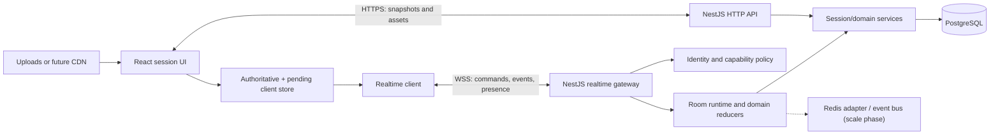

# Realtime Multiplayer and Collaboration Transport

| Field | Value |
| --- | --- |
| Status | Proposed |
| Owners | Application team |
| Last updated | 2026-07-14 |
| Target | Incremental delivery beginning with a live game session |

This document is the durable technical plan for adding realtime game sessions to World Building. It records the intended architecture, protocol, failure behavior, security boundaries, delivery phases, and unresolved decisions so implementation can proceed across multiple sessions without losing context.

## 1. Context

The current application has:

- a Next.js 16 / React 19 frontend;
- a NestJS 10 backend on port 8000;
- PostgreSQL through TypeORM for generated worlds;
- a LevelGraph store for lore relationships;
- Auth0 integration in the frontend, with a local demo fallback;
- a session route that currently renders static fixture summaries; and
- no shared domain package, persistent session model, backend authorization layer, or realtime transport.

The desired experience is a live tabletop session shared by distributed players. Movement, visual effects, sound cues, chat, dice, presence, and other common multiplayer interactions should feel immediate. Network delays and short outages must not corrupt the session or make the interface unnecessarily sluggish. The same underlying transport should later support GM-enabled collaboration in world editors.

## 2. Goals

1. Deliver perceived local responsiveness for ordinary player actions.
2. Keep the server authoritative for permissions, hidden information, rules, and durable state.
3. Recover predictably from disconnection, duplication, reordering at reconnect boundaries, client refreshes, and process restarts.
4. Use bandwidth deliberately: send commands and deltas, coalesce transient updates, and transfer large assets out of band.
5. Make protocol evolution explicit and backwards-compatible within a supported version window.
6. Reuse connection management, identity, rooms, ordering, recovery, and observability for GM-authorized world editing.
7. Support horizontal scaling without requiring it in the first implementation.
8. Give developers enough visibility to reproduce and diagnose session failures.

## 3. Non-goals

- Voice or video conferencing. Use a dedicated WebRTC/media service if introduced later.
- Streaming audio files through the WebSocket. The protocol synchronizes playback; HTTP/CDN delivers and caches assets.
- Competitive action-game latency or physics. The initial target is tabletop-scale token movement and effects.
- Offline multi-user editing in the first gameplay release.
- A complete rules engine or any one RPG system's mechanics.
- End-to-end encryption between players. TLS protects transport; the server must inspect commands to authorize them.
- Using the WebSocket as the canonical database.

## 4. Design principles

### 4.1 Server authority with responsive clients

The server decides whether a command is legal and emits the canonical result. The client predicts safe user-visible results and marks them pending until the server confirms or corrects them. Hidden state and privileged GM actions are never inferred or distributed to unauthorized clients.

### 4.2 One transport, explicit domains

Gameplay and editing share a transport envelope but use separate domain messages and reducers. A connection joins one or more scopes, and each scope grants explicit capabilities. This avoids a future second connection stack while keeping gameplay and document consistency models independent.

### 4.3 Durable facts versus transient signals

Messages have one of three delivery classes:

| Class | Examples | Stored/replayed | Handling |
| --- | --- | --- | --- |
| Durable | chat posted, token move committed, roll result, permission change | Yes | Ordered, acknowledged, idempotent |
| Ephemeral | cursor, typing, drag preview, pointer ping | No | Coalesced; latest value wins |
| Scheduled media | sound cue, animation/effect trigger | Event is durable when narratively relevant; asset bytes are not | Use server time and cached asset ID |

### 4.4 HTTP for bulk data, WebSocket for coordination

Initial snapshots may be fetched over authenticated HTTP when large. Maps, portraits, audio, and other binary assets use immutable URLs and normal browser caching. The WebSocket carries identifiers, small state deltas, and timing information.

### 4.5 NestJS-first implementation

Use NestJS capabilities and supported platform packages as the default implementation surface. Realtime behavior should remain inside Nest modules, injectable providers, gateways, guards, pipes, interceptors, exception filters, and lifecycle hooks. Do not build a parallel raw `ws` server or a custom dependency-injection/lifecycle system.

The preferred packages are:

- `@nestjs/websockets` for gateways, message decorators, lifecycle hooks, and WebSocket exceptions;
- `@nestjs/platform-ws` for the built-in, browser-compatible `WsAdapter`;
- `class-validator` and `class-transformer` through Nest validation pipes for DTO validation;
- `@nestjs/typeorm` for transactional durable state and repositories;
- `@nestjs/config` for typed realtime settings and environment validation;
- `@nestjs/throttler` for coarse connection/user limits, supplemented by a realtime-aware guard for per-message and per-scope limits;
- `@nestjs/schedule` only for low-volume maintenance such as snapshot cleanup, not heartbeat timing or event delivery; and
- `@nestjs/bullmq` only when durable background work is needed, such as event compaction or media preprocessing. Command handling and live fan-out must not take a queue round trip.

Prefer an official Nest integration or a small Nest adapter around a mature library over freestanding infrastructure. A custom `WebSocketAdapter` is allowed only if profiling or a required codec proves that the built-in `WsAdapter` cannot meet the requirement, and the reason is recorded in the decisions table.

## 5. Proposed architecture



### 5.1 Frontend responsibilities

- Establish, authenticate, resume, and close the connection.
- Maintain clock-offset and connection-health estimates.
- Hold an authoritative snapshot plus ordered authoritative events.
- Hold pending local commands separately and derive the predicted view.
- Apply domain-specific prediction and reconciliation.
- Cache static assets and schedule media against server time.
- Surface connection, pending, corrected, and failed states accessibly.

The realtime connection should be owned by a provider above individual session panels so route subcomponents do not create competing sockets. Domain stores subscribe only to scopes they render.

### 5.2 Backend responsibilities

- Authenticate the socket and bind it to an immutable user identity.
- Authorize scope joins and every command; joining a room alone is not authorization.
- Validate message shape, size, rate, current aggregate version, and capability.
- Serialize commands per aggregate, apply the domain reducer, persist durable results, and publish events.
- Filter events and snapshot fields for each recipient's visibility.
- Maintain presence, replay windows, and connection health.
- Emit metrics and correlated structured logs without logging private message bodies.

### 5.3 NestJS module boundaries

The backend should evolve toward these modules and providers:

```text
RealtimeModule
├── RealtimeGateway                 @WebSocketGateway({ path: '/realtime' })
├── RealtimeAuthGuard               ticket/connection identity
├── ScopeCapabilityGuard            membership and message capability
├── RealtimeRateLimitGuard          connection/user/scope/message limits
├── RealtimeValidationPipe          shared DTO/schema validation
├── RealtimeExceptionFilter         stable system.command.rejected envelopes
├── RealtimeTelemetryInterceptor    correlation, latency, byte counts
├── ConnectionRegistry              live sockets and bounded queues
├── ScopeRegistry                   local scope membership and presence
└── RealtimePublisher               recipient-filtered delivery

SessionModule
├── SessionCommandService           command transaction boundary
├── SessionProjectionService        snapshots and recipient projections
├── SessionReplayService            replay/snapshot selection
├── SessionPolicyService            capability decisions
└── TypeORM repositories/entities

ProtocolModule (or shared workspace package)
├── message DTOs and discriminated types
├── codecs and version negotiation
└── deterministic domain reducers
```

`RealtimeGateway` is deliberately thin: decorators route messages and framework components handle cross-cutting concerns; injectable domain services validate intent, transact, and return outcomes. Use `OnGatewayInit`, `OnGatewayConnection`, and `OnGatewayDisconnect` for adapter initialization and connection bookkeeping. Avoid putting persistence, game rules, or large switch statements in the gateway.

### 5.4 Initial deployment and scaling path

The first implementation may use a single NestJS process with an in-memory room registry, a bounded per-room replay buffer, and PostgreSQL persistence. This matches the current Docker Compose topology.

Before running more than one backend replica, add Redis (or an equivalent low-latency broker) for:

- connection/room routing;
- fan-out between gateway instances;
- distributed presence with TTLs; and
- short replay buffers or invalidation signals.

PostgreSQL remains the canonical store for durable session state and event history. Redis is not the source of truth. Sticky sessions reduce traffic but must not be required for correctness.

## 6. Domain and state model

### 6.1 Core identifiers

- `connectionId`: one physical socket; changes after reconnect.
- `clientInstanceId`: persisted per browser tab/session; useful for diagnostics.
- `userId`: authenticated person.
- `participantId`: a user's membership in a game session.
- `scopeId`: the authorization and ordering boundary, such as `session:<sessionId>`.
- `entityId`: a token, scene, effect, message, document, or other aggregate member.
- `commandId`: client-generated UUIDv7, stable across retries.
- `eventId`: server-generated UUIDv7.
- `epoch`: changes when a scope's event sequence is reset or restored.
- `seq`: strictly increasing event number within one scope and epoch.

IDs are opaque. Clients must not infer access from knowing an ID.

### 6.2 Gameplay scope

An initial `session:<sessionId>` scope includes:

- session lifecycle and active scene;
- participants and presence;
- maps and token placement;
- public chat and permitted private channels;
- dice results;
- visual/audio cues; and
- capability changes.

Large or independently secured features can later become child scopes, for example `session:<id>:chat:<channelId>`. Start with one ordered session scope unless profiling shows contention or unacceptable head-of-line blocking.

### 6.3 Authority and visibility

Suggested roles are `gm`, `player`, `spectator`, and `collaborator`, but commands authorize against capabilities rather than hard-coded role checks. Example capabilities:

- `session.read`
- `session.manage`
- `token.move.own`
- `token.move.any`
- `chat.post`
- `effect.trigger`
- `audio.control`
- `document.read`
- `document.edit`
- `document.invite`

Each event carries a visibility classification internally (`public`, `gm`, participant IDs, or channel IDs). The gateway produces recipient-specific projections before serialization. Never broadcast a full event and rely on the frontend to hide secret fields.

### 6.4 Persistence model

Add normalized entities rather than expanding the existing `World.metadata` JSON blob:

| Entity | Important fields |
| --- | --- |
| `GameSession` | id, campaignId, status, activeSceneId, version, createdAt, updatedAt |
| `SessionParticipant` | id, sessionId, userId, role, capabilities, joinedAt |
| `Scene` | id, sessionId, asset references, dimensions, grid, version |
| `TokenState` | id, sceneId, controller IDs, position, rotation, visibility, version |
| `SessionSnapshot` | sessionId, epoch, throughSeq, projection JSON, createdAt |
| `SessionEvent` | eventId, sessionId, epoch, seq, type, schemaVersion, payload, visibility, actorId, commandId, createdAt |
| `ChatMessage` | id, sessionId/channelId, authorId, body, status, createdAt, editedAt |

`SessionEvent(sessionId, epoch, seq)` and `(sessionId, commandId)` require unique indexes. Event and projection changes caused by a durable command must commit in one database transaction. An outbox table is required when cross-process publication is added, preventing a committed state change from being lost before fan-out.

Event retention should be policy-driven. Chat/audit events may be retained, while high-frequency movement history can be compacted after snapshots. Do not assume every position sample belongs in permanent storage.

## 7. Transport and wire protocol

### 7.1 WebSocket endpoint

Use a WebSocket endpoint at `/realtime`, served by the existing NestJS HTTP application and exposed as `wss://` in production. Register Nest's built-in `WsAdapter` once during bootstrap with `app.useWebSocketAdapter(new WsAdapter(app))`, then register `RealtimeGateway` as a provider of `RealtimeModule`. This preserves Nest dependency injection, gateway decorators, lifecycle hooks, guards, pipes, filters, and interceptors while using the efficient native-browser WebSocket protocol.

The Nest `WsAdapter` expects logical messages in `{ event, data }` form. Configure its supported `messageParser` to map the protocol envelope's `kind` to `event` and the complete decoded envelope to `data`. Message handlers then use `@SubscribeMessage()`, `@MessageBody()`, and DTO-specific pipes. Do not access the raw socket with `@ConnectedSocket()` in ordinary handlers when doing so would bypass interceptor behavior; isolate necessary socket operations in the connection registry/publisher.

Browser authentication is a two-step flow:

1. The authenticated client requests a single-use, short-lived realtime ticket over HTTPS.
2. It opens the socket and sends the ticket in the first `system.authenticate` message within five seconds.

The ticket is scoped to the user and intended audience, expires in at most 60 seconds, and is consumed once. Do not put long-lived bearer tokens in query strings. The gateway also validates the `Origin` header. Demo identities must be disabled outside explicit local development mode.

### 7.2 Codec negotiation

The first client offers supported protocol versions and codecs during authentication:

```json
{
  "v": 1,
  "kind": "system.authenticate",
  "id": "019abc...",
  "payload": {
    "ticket": "single-use-ticket",
    "clientInstanceId": "019abc...",
    "protocols": [1],
    "codecs": ["msgpack", "json"]
  }
}
```

- JSON is required in development and during the first vertical slice because it is inspectable.
- MessagePack becomes the production default after compatibility and payload benchmarks pass.
- The selected codec applies after `system.authenticated`.
- Codec decoding belongs in the Nest adapter's configured message parser. Start with the built-in adapter and a JSON parser; add MessagePack at that boundary after benchmarks. Do not leak codec concerns into gateways or domain services.
- Compression is disabled initially for small high-frequency frames; per-message deflate is considered only after measurement because it adds CPU and can amplify security risks.
- Protocol limits are enforced on decoded size, collection length, string length, and nesting depth.

### 7.3 Common envelope

All post-authentication messages use the same logical envelope. Short binary field aliases may be introduced by the MessagePack codec without changing the logical schema.

```ts
interface RealtimeEnvelope<T> {
  v: 1;                    // major wire protocol
  kind: string;            // e.g. "game.token.move.command"
  id: string;              // command/event/control message ID
  scope?: string;          // e.g. "session:8d..."
  seq?: number;            // authoritative server event sequence
  epoch?: string;          // sequence lineage
  ref?: string;            // command ID being acknowledged/rejected
  sentAt?: number;         // Unix epoch milliseconds
  payload: T;
}
```

Identity, role, and capabilities are never accepted from client payloads; they come from the authenticated connection and server-side membership.

### 7.4 Message naming

Use `<domain>.<subject>.<action>.<class>`:

- `system.scope.join.command`
- `system.scope.joined.event`
- `game.token.move.command`
- `game.token.moved.event`
- `game.effect.trigger.command`
- `game.effect.triggered.event`
- `media.audio.play.command`
- `media.audio.played.event`
- `chat.message.post.command`
- `chat.message.posted.event`
- `presence.pointer.update.signal`
- `document.operation.submit.command` (reserved for future collaboration)

Message schemas live in a shared TypeScript package and are validated on both sides from one source. Avoid accepting arbitrary JSON patches against server objects. Commands are intent-oriented and permit domain validation.

### 7.5 Command example

```json
{
  "v": 1,
  "kind": "game.token.move.command",
  "id": "019c-command-uuid",
  "scope": "session:8db1",
  "sentAt": 1784073600123,
  "payload": {
    "tokenId": "token:hero-1",
    "fromVersion": 41,
    "path": [[12.5, 8], [13, 8], [14, 9]],
    "clientDurationMs": 420
  }
}
```

Successful authoritative event:

```json
{
  "v": 1,
  "kind": "game.token.moved.event",
  "id": "019c-event-uuid",
  "scope": "session:8db1",
  "epoch": "019c-session-epoch",
  "seq": 913,
  "ref": "019c-command-uuid",
  "sentAt": 1784073600181,
  "payload": {
    "tokenId": "token:hero-1",
    "fromVersion": 41,
    "version": 42,
    "path": [[12.5, 8], [13, 8], [14, 9]],
    "position": [14, 9],
    "actorParticipantId": "participant:6b2"
  }
}
```

Rejected command:

```json
{
  "v": 1,
  "kind": "system.command.rejected",
  "id": "019c-rejection-uuid",
  "scope": "session:8db1",
  "ref": "019c-command-uuid",
  "payload": {
    "code": "STALE_ENTITY_VERSION",
    "retryable": true,
    "entityId": "token:hero-1",
    "currentVersion": 42
  }
}
```

Errors expose stable codes and safe context, not stack traces. Human-readable UI text is derived client-side so it can be localized.

### 7.6 Timing, movement, effects, and sound

- Maintain a server clock-offset estimate using heartbeat round trips; use several samples and reject outliers.
- A media/effect event contains `startAt` in server epoch time, `assetId`, parameters, and optional duration. A late client seeks to the appropriate offset when meaningful or skips an expired cosmetic cue.
- Movement commits at a tabletop-appropriate rate, initially capped at 10 commands/second per controlled token. Drag previews may send ephemeral samples up to 20 Hz and are coalesced by `(participantId, tokenId)`.
- Other clients interpolate between accepted movement samples. The controlling client predicts its own movement and eases small corrections; large or illegal corrections snap with a visible explanation.
- Send coordinates as bounded scene-space numbers. If profiling warrants it, MessagePack may encode fixed-point integers later; do not prematurely reduce map fidelity.
- Visual/audio payloads refer to declarative, allowlisted effect types and asset IDs. Never distribute executable code or arbitrary asset URLs in an event.

### 7.7 Heartbeats and backpressure

Use WebSocket ping/pong where supported plus an application heartbeat carrying server time and scope lag. Suggested defaults:

- heartbeat every 15 seconds;
- consider a connection unhealthy after two missed intervals;
- reconnect with exponential backoff plus jitter: 250 ms, 500 ms, 1 s, 2 s, up to 10 s;
- cap outbound queue bytes and message count per connection;
- coalesce or drop stale ephemeral signals before durable events; and
- disconnect a persistently slow consumer with `SLOW_CONSUMER`, preserving its resume position.

## 8. Optimistic rendering and reconciliation

The client store has three layers:

1. `base`: latest authoritative snapshot plus applied events;
2. `pending`: locally issued commands in creation order; and
3. `view`: `reducePending(base, pending)`, the state React renders.

When the user acts:

1. Validate obvious local constraints.
2. Create a stable `commandId` and add the command to `pending`.
3. Render its predicted result immediately.
4. Send it, or retain it in a bounded queue if reconnecting and the command is safe to retry.
5. When the matching authoritative event arrives, apply it to `base`, remove the pending command, and replay remaining pending commands.
6. On rejection, remove the rejected command, apply any supplied correction/current event, replay remaining commands, and show context-appropriate feedback.

Prediction policy is message-specific:

| Interaction | Prediction |
| --- | --- |
| Own token movement | Full local prediction; reconcile position/version |
| Chat post | Insert with `sending`; replace using command/event correlation |
| Cosmetic effect | Preview immediately if authorized locally; cancel/correct on rejection |
| Dice roll | Show rolling state only; result is server-generated |
| GM secret/reveal | No speculative disclosure |
| Sound cue | GM UI may preview locally, but participant playback follows server event |

Pending durable commands survive brief reconnects in memory. Persisting them across full browser restarts is deferred until commands are classified for safe replay. Never replay an expired movement, sound, or reveal command after a long outage.

## 9. Ordering, idempotency, and recovery

### 9.1 Normal ordering

WebSocket supplies ordered frames on one live connection. The protocol additionally assigns `seq` to durable authoritative events so ordering can be verified and resumed across connections. A client applies event `n` only after `n - 1` for the same scope/epoch. Ephemeral signals do not consume durable sequence numbers.

Commands that target mutable entities include `fromVersion`. The server may reject a stale command, or safely transform it only when the domain explicitly defines that behavior.

### 9.2 Idempotency

The server stores the outcome keyed by `(scopeId, commandId)`. A retried command returns or republishes the existing outcome rather than applying twice. This is mandatory for chat, dice, inventory/rules effects, permissions, and editor operations.

### 9.3 Resume handshake

On reconnect the client authenticates, then joins with its checkpoint:

```json
{
  "v": 1,
  "kind": "system.scope.join.command",
  "id": "019c-join",
  "scope": "session:8db1",
  "payload": {
    "epoch": "019c-session-epoch",
    "afterSeq": 913,
    "snapshotHash": "sha256:..."
  }
}
```

The server chooses one response:

- `system.scope.resumed.event` followed by events `914..current`;
- `system.scope.snapshot.event` with a small filtered snapshot; or
- `system.scope.snapshot_available.event` with a short-lived authenticated HTTP URL, hash, epoch, and through-sequence for a large snapshot.

Events received during snapshot loading are buffered. After verifying the snapshot hash, the client applies buffered events starting at `throughSeq + 1`. An epoch mismatch always requires a fresh snapshot.

### 9.4 Failure cases

| Failure | Required behavior |
| --- | --- |
| Duplicate command | Return prior outcome; do not reapply |
| Sequence gap | Pause that scope, request replay, then snapshot if unavailable |
| Socket interruption | Keep predicted UI with reconnect indicator; stop unsafe new actions |
| Authentication expiry | Refresh ticket over HTTPS and reconnect; do not send secrets in-band |
| Server restart | Rebuild room from latest snapshot plus events; clients resume or resnapshot |
| Invalid/oversized frame | Reject with code; close after serious or repeated violations |
| Slow consumer | Drop/coalesce ephemeral data, then disconnect and resume later |
| Conflicting token move | Rebase if domain-safe; otherwise reject and reconcile visibly |
| Media asset missing | Continue session, report telemetry, show non-blocking fallback |
| Database unavailable | Reject durable commands as retryable; do not claim success before commit |

The UI distinguishes `connected`, `reconnecting`, `resyncing`, and `offline`. It should identify pending messages/actions and announce material corrections without blocking unaffected panels.

## 10. Collaboration extension

The gameplay release should implement the following extension points now:

- generic `scope`, join, leave, resume, and snapshot messages;
- capabilities returned on join and updated by server event;
- domain-prefixed schemas and reducers;
- recipient-filtered projections; and
- idempotent command/event correlation.

Later, a GM enables collaboration by granting `document.read` or `document.edit` on a scope such as `world:<worldId>:document:<documentId>`. Revocation emits a capability event and immediately stops accepting further edits.

Text and rich-document collaboration should use a proven CRDT library rather than last-write-wins JSON patches. The CRDT update bytes can be carried as a binary `document.operation.submit.command` payload and persisted/compacted separately. Structured entities such as locations, encounters, or graph relationships should continue using intent commands and field/entity versions where business rules matter. Presence, selections, and cursors remain ephemeral.

This separation is intentional: a token move needs server validation and a clear authoritative result, while simultaneous prose editing benefits from commutative CRDT operations. They reuse transport and access control, not necessarily the same conflict algorithm.

## 11. Security and abuse resistance

- Require TLS and authenticated membership for every non-public scope.
- Enforce authorization per command and filter every outbound projection.
- Validate Origin, schema, numeric bounds, asset IDs, and referenced entity ownership.
- Rate-limit by user, connection, scope, and message kind; provide stricter limits for chat and expensive rules operations.
- Sanitize chat and rendered rich content; use React text rendering by default.
- Store secrets and GM-only data in separate projections or visibility-filtered events.
- Record capability changes, moderation, dice results, and privileged GM actions in an audit trail.
- Avoid logging tickets, chat bodies, private notes, or full snapshots.
- Apply maximum decoded frame size (initial proposal: 64 KiB) and direct larger data to HTTP.
- Close unauthenticated connections quickly and cap connections per account/IP.
- Treat client timestamps, positions, role claims, and entity versions as untrusted input.

A threat-model review is a release gate before inviting external players.

## 12. Observability and operations

Structured logs include `connectionId`, `userId` (or privacy-preserving hash), `scopeId`, `commandId`, `eventId`, `kind`, result code, server processing time, and payload byte count.

Minimum metrics:

- active connections and joined scopes;
- connection/auth/join failures;
- command rate, rejection rate, and processing latency by kind;
- event fan-out latency and encoded bytes;
- heartbeat RTT and reconnect/resume success rate;
- replay depth, snapshot frequency, and sequence-gap count;
- pending-command confirmation latency (p50/p95/p99);
- dropped ephemeral messages and slow-consumer disconnects;
- database transaction/outbox failures; and
- client reconciliation correction magnitude for movement.

Propagate a correlation ID from command through database transaction, authoritative event, and client acknowledgement. Add a development protocol inspector that can redact payloads, simulate latency/loss/disconnects, and export a bounded event trace.

Initial service-level objectives, to validate with real usage:

- p95 local predicted response under one animation frame;
- p95 command-to-authoritative-event under 150 ms within the deployment region;
- p95 remote visible update under 250 ms within the deployment region;
- 99.9% successful replay or snapshot recovery for interruptions under five minutes; and
- zero duplicated durable effects under retry testing.

## 13. Testing strategy

### 13.1 Schema and reducer tests

- Round-trip every message through JSON and MessagePack codecs.
- Reject unknown required versions, malformed payloads, excessive sizes, and invalid bounds.
- Golden fixtures protect backwards compatibility.
- Domain reducers are deterministic and side-effect free.
- Property tests cover event ordering, duplicate commands, pending replay, and snapshot equivalence.

### 13.2 Integration tests

- Authenticate, join, command, fan-out, leave, and resume with two or more clients.
- Verify each capability and visibility boundary, especially GM-only fields.
- Restart the gateway between command and reconnect.
- Force duplicate delivery and stale entity versions.
- Verify transactional event/projection persistence and eventual outbox publication.

### 13.3 Browser and experience tests

- Two browser contexts move tokens, chat, trigger effects, and play synchronized sound.
- Simulate 50–500 ms latency, jitter, disconnects, slow clients, and reconnects.
- Confirm pending/reconnecting/resync UI and correction animations.
- Confirm keyboard and screen-reader announcements for connection state and failed actions.

### 13.4 Load tests

Model at least 10 participants per session initially, with 100 concurrently active sessions as a planning scenario. Test steady movement previews, chat bursts, effect fan-out, reconnect storms, and large snapshot recovery. Establish capacity from measurements rather than treating these planning figures as product limits.

## 14. Incremental delivery plan

### Phase 0 — Foundations

- Add a shared protocol/schema package used by frontend and backend.
- Add backend authentication/authorization primitives and realtime ticket endpoint.
- Add session, participant, event, and snapshot persistence with migrations; disable TypeORM `synchronize` outside local development.
- Add `RealtimeModule` configuration and tests around Nest guards, pipes, filters, and interceptors.
- Define the connection-state UI and telemetry conventions.

Exit: schemas validate in both runtimes, an authenticated user can obtain a scoped ticket, and persistence migrations are repeatable.

### Phase 1 — Realtime vertical slice

- Add `@nestjs/websockets`, `@nestjs/platform-ws`, the Nest `WsAdapter`, and a thin `RealtimeGateway` using JSON.
- Implement authenticate, heartbeat, join/leave, scope capabilities, event sequences, command IDs, and replay.
- Replace the static session route with a live shell showing connection state and participant presence.
- Implement public chat with optimistic send and idempotent confirmation.

Exit: two browser clients can join, exchange chat, disconnect, resume without duplicates, and recover by replay or snapshot.

### Phase 2 — Shared scene and movement

- Add scene/token persistence, snapshot projection, and movement authorization.
- Add local prediction, remote interpolation, drag previews, reconciliation, and stale-version handling.
- Add protocol/network simulation tests and basic load tests.

Exit: distributed clients see responsive movement and converge after conflicts and reconnects.

### Phase 3 — Effects, sound, and typical mechanics

- Add server-time synchronization and cached asset manifests.
- Add declarative effects, audio scheduling, dice, pings, typing, and private chat channels as product needs dictate.
- Introduce MessagePack only after measured comparison against JSON.

Exit: media cues remain acceptably synchronized and late/reconnecting clients follow documented policy.

### Phase 4 — Scale and hardening

- Add Redis fan-out/presence, transactional outbox, multi-instance tests, rate limits, dashboards, retention/compaction jobs, and threat-model fixes.
- Run reconnect storms and failure injection against production-like infrastructure.

Exit: multiple backend instances preserve authorization, ordering, idempotency, and recovery targets.

### Phase 5 — GM-enabled editing collaboration

- Add document scopes and GM-controlled grants/revocation.
- Select and integrate a CRDT for rich text; keep structured domain commands for rule-bound entities.
- Add collaborative cursor/selection presence and document compaction.

Exit: authorized editors converge, unauthorized clients receive no protected content, and revocation takes effect immediately.

## 15. Decisions and alternatives

| Decision | Chosen approach | Why | Revisit when |
| --- | --- | --- | --- |
| Authority | Server-authoritative with client prediction | Protects rules/secrets while preserving responsiveness | Never globally; tune prediction per command |
| Server framework | NestJS-first modules, gateway, providers, guards, pipes, filters, and interceptors | Reuses the backend's DI, lifecycle, validation, and testing model | A measured framework limitation blocks a requirement |
| Transport | Nest `WsAdapter` (`@nestjs/platform-ws`) over native browser WebSocket | Official Nest integration, low framing overhead, and full gateway lifecycle | Need Socket.IO-specific features, unreliable datagrams, or peer media |
| Initial codec | JSON, then measured MessagePack | Debuggable vertical slice with a clear efficiency path | Before production traffic or if bandwidth is already material |
| Persistence | PostgreSQL projections + event journal/snapshots | Fits current stack and recovery/audit needs | Event volume or retention cost requires specialized storage |
| Horizontal fan-out | Redis in scale phase | Avoids premature operational dependency | Before second backend replica |
| Bulk/media transfer | Authenticated HTTP/CDN | Caching, range requests, and less socket backpressure | No planned change |
| Editor conflicts | CRDT for documents; intent commands for structured entities | Different domains need different consistency semantics | During collaboration prototype |
| One ordered gameplay scope | Start simple | Easier convergence and debugging | Measured head-of-line or throughput issue |

## 16. Open questions

These decisions should be recorded here as they are resolved:

1. What are the expected maximum participants, active sessions, map/token counts, and regional distribution?
2. Does a session need anonymous invite links, or only registered Auth0 users?
3. Which actions and chat channels must survive after a session ends, and for how long?
4. Should a player's browser be allowed to control the same character from multiple tabs/devices?
5. What correction UX is acceptable when the GM overrides or rejects movement?
6. Which media must synchronize tightly, and is late join playback desired for ambience versus one-shot cues?
7. Are private whispers and GM notes subject to audit or deletion requirements?
8. Is multi-region hosting expected? If so, choose scope affinity and database topology before promising latency targets.
9. Which world editors need collaboration first: prose, map, structured lore, or graph relationships?
10. What is the supported protocol-version window during rolling frontend/backend deployments?

## 17. Implementation guardrails

- Do not implement domain state as ad hoc React component messages.
- Do not create a standalone raw WebSocket server alongside Nest or bypass Nest providers for domain work.
- Do not place game rules and persistence in gateway handler methods; delegate to injectable services.
- Do not acknowledge a durable command before its transaction commits.
- Do not use timestamps as the event ordering mechanism.
- Do not retry commands without a stable `commandId` and message-specific expiry policy.
- Do not place assets, snapshots, or unbounded CRDT history in ordinary WebSocket frames.
- Do not trust client-side role checks or broadcast secrets for client-side filtering.
- Do not add a second collaboration transport before proving the shared scope model is insufficient.
- Every new durable message kind needs a schema, authorization rule, reducer test, idempotency behavior, recovery behavior, and observability fields.

## 18. NestJS implementation references

- [NestJS WebSocket gateways](https://docs.nestjs.com/websockets/gateways): gateways are providers and support Nest dependency injection, decorators, guards, pipes, interceptors, filters, and lifecycle hooks.
- [NestJS WebSocket adapters](https://docs.nestjs.com/websockets/adapter): the built-in `WsAdapter`, message parser, custom adapter extension point, and official Socket.IO Redis adapter example.
- [NestJS WebSocket guards](https://docs.nestjs.com/websockets/guards): gateway/method guards and `WsException` behavior.
- [NestJS queues](https://docs.nestjs.com/techniques/queues): BullMQ integration for durable asynchronous background work, where appropriate.

## 19. Definition of done for the first useful release

The first release is complete when two authenticated users can open the same session route and:

- see accurate participant and connection state;
- exchange optimistic, deduplicated public chat;
- move permitted tokens with immediate local response and smooth remote updates;
- converge to the same authoritative state after simultaneous actions;
- reconnect after a transient outage without duplicate durable effects;
- recover from a server restart through replay or a verified snapshot;
- receive no GM-only state without the corresponding capability; and
- provide sufficient metrics and correlation IDs to diagnose a failed command end to end.
