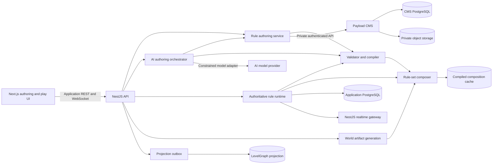

# Rule sets design

| Attribute | Value |
| --- | --- |
| Status | Proposed |
| Audience | Product, architecture, backend, frontend, content, QA, and operations |
| Primary owner | World Building platform team |
| Last updated | 2026-07-14 |
| Related designs | [Realtime multiplayer](./realtime-multiplayer-design.md), [Headless CMS survey](./headless-cms-market-survey.md), [Payload implementation](./payload-cms-implementation.md) |

## 1. Executive summary

The World Building platform will let a game master (GM) design, publish, compose, and apply original rule sets to worlds and campaigns. A rule set describes data, calculations, constraints, actions, effects, resources, generation guidance, and resolution procedures using a typed, declarative model. Familiar concepts such as characters, skills, damage, turns, or spell slots may be created by an author, but none is built into the platform's core model.

The design deliberately separates four concerns:

1. **Authored definitions** describe what a rule set means. Payload CMS stores these versioned documents and their supporting media.
2. **Compiled rule artifacts** are validated, normalized representations generated by NestJS for fast and safe evaluation.
3. **Runtime state** records the current values of entities in a world or campaign. It remains in the application database, not the CMS.
4. **Derived relationships** may be projected into LevelGraph for traversal and discovery, but Payload and the application database remain the systems of record.

NestJS is the only public rule-set API and the authoritative execution boundary. It validates definitions, composes compatible releases, evaluates expressions, commits state changes, enforces authorization, records an audit trail, and publishes real-time outcomes. The browser never calls Payload directly. Published rule-set releases are immutable. Worlds and campaigns pin an immutable composition manifest containing exact releases, and composition changes require an explicit impact preview and any necessary migration.

The first implementation will not execute arbitrary JavaScript or third-party code. A bounded expression language and resolution pipeline provide determinism, portability, validation, replay, and protection from malicious or accidentally expensive definitions.

## 2. Problem statement

Different role-playing games organize their rules in radically different ways. A platform model based on one game's nouns—class, level, armor class, spell, feat, or saving throw—will either exclude other rule sets or accumulate special cases. A collection of configurable character-sheet fields is also insufficient: modern rule sets contain derived values, conditional modifiers, resource consumption, contested and multi-step actions, persistent effects, choice constraints, random resolution, and lifecycle rules.

The platform therefore needs a rule-set language rather than a fixed RPG schema. That language must be expressive enough to model the *design* of complex contemporary tabletop rules while remaining safe for user-authored content and practical for interactive play.

## 3. Goals

- Let a GM create a rule set without writing or deploying application code.
- Express a wide range of tabletop mechanics without privileged, game-specific concepts.
- Support structured entities, reusable traits, derived values, references, resources, actions, effects, randomizers, and lifecycle events.
- Provide deterministic, explainable evaluation when supplied the same state and recorded entropy.
- Validate definitions before publication and provide precise, author-friendly diagnostics.
- Keep published campaigns stable through immutable releases and explicit migrations.
- Support preview, optimistic UI, idempotent commands, recovery, and authoritative real-time outcomes.
- Make definitions portable through a canonical, versioned import/export format.
- Dynamically compose compatible rule-set releases without deploying code, producing an immutable aggregate definition for reliable runtime use.
- Let a world or campaign select among named rule-set compositions so the same world can support materially different gameplay experiences.
- Make applicable rule-set identities and generation constraints mandatory inputs to world-artifact generation and provenance.
- Allow collaborative editing later at the GM's discretion without changing the rule model.
- Preserve clear ownership boundaries among Payload, NestJS, application PostgreSQL, object storage, and LevelGraph.
- Enforce tenant isolation, author permissions, execution limits, and a complete audit trail.

## 4. Non-goals

- Shipping implementations of commercial or proprietary rule sets.
- Encoding the terminology or document organization of any single game in platform code.
- Making every rule set automatically compatible with every existing character sheet or world.
- Silently deleting, rewriting, or reclassifying existing world artifacts when the active rule-set composition changes.
- Providing a general-purpose programming language, package manager, or server plugin runtime.
- Simulating physics, animation, voice, or audio transport; rules may emit semantic cues consumed by those systems.
- Using Payload CMS for high-frequency game state, presence, connection state, or event delivery.
- Requiring real-time collaboration in the first authoring release.
- Guaranteeing automatic migration between arbitrary user-authored releases.

## 5. Design principles

### 5.1 Domain language is content

The engine knows about values, types, entities, operations, effects, events, and state. It does not know about heroes, monsters, hit points, initiative, spells, moves, or levels. Authors supply labels, descriptions, icons, grouping, and presentation hints.

### 5.2 Definitions and instances are different

A definition says that an entity type has a numeric field with a derived default. An instance is a particular entity and its current field value. Definitions are authored and versioned content; instances are mutable runtime state.

### 5.3 Published releases are immutable

Editing always occurs in a draft. Publishing creates a content-addressed release. Existing campaigns continue using their pinned composition until an authorized user explicitly changes it.

### 5.4 Safe, declarative execution

Rules are data interpreted by a bounded engine. Expressions cannot access the filesystem, network, environment, wall clock, database, or arbitrary code. Time and entropy enter only as explicit, recorded inputs.

### 5.5 Stable identity over display names

Every addressable definition has an immutable identifier. Names and labels may change without breaking stored instances, references, expressions, translations, or migrations.

### 5.6 Explainability is a feature

Evaluation produces a trace describing inputs, derived values, modifiers, random results, decisions, and state changes. The same trace supports UI explanations, debugging, audit, and replay.

### 5.7 The authoritative server owns truth

Clients may predict low-risk results, but NestJS validates and commits every authoritative change. Idempotency keys and optimistic concurrency prevent duplicate or stale writes.

## 6. Terminology

| Term | Meaning |
| --- | --- |
| Rule set | A long-lived authored unit of rules, including its metadata, drafts, and release history |
| Rule | Author-facing umbrella term for an addressable definition or coordinated group of definitions that expresses one mechanic |
| Module | A namespace and dependency boundary within a rule set |
| Definition | An addressable type, field, operation, effect, event, catalog, or UI description |
| Draft | Mutable working content not used by active runtime bindings |
| Release | Immutable, validated snapshot of a rule set and locked dependencies |
| Composition | An ordered, immutable manifest of exact rule-set releases plus explicit merge, override, exclusion, and conflict policies |
| Gameplay profile | A named composition that a GM may apply to a world or campaign |
| Binding | Association of a world or campaign with an exact composition hash |
| Generation context | Immutable provenance describing the composition, generation policies, inputs, and model/tool versions used to create a world artifact |
| Authoring proposal | A structured, validated draft patch produced by an AI-guided conversation but not applied until an authorized author accepts it |
| Entity type | Schema for a kind of runtime object; its user-facing name is author-defined |
| Trait | Reusable group of fields, constraints, operations, and event handlers |
| Instance | Runtime object conforming to an entity type in a pinned composition |
| Expression | Typed, pure syntax tree that computes a value from declared inputs |
| Operation | User- or engine-invoked procedure that may validate, resolve, and change state |
| Effect | A scoped, attributable change or modifier with an optional lifetime |
| Evaluation trace | Structured explanation of how a result was calculated |
| Migration | Explicit transformation from one published release to another |

## 7. Representative capabilities

The metamodel must be able to represent, without built-in rule-set-specific nouns:

- entities composed from reusable traits;
- scalar, structured, collection, reference, and resource values;
- enumerated choices and authored catalogs;
- defaults, constraints, visibility, and conditional requirements;
- derived values and dependency-aware recalculation;
- actions with parameters, target selection, prerequisites, costs, random or deterministic resolution, and multiple outcomes;
- modifiers that add, multiply, replace, cap, filter, or transform values under conditions;
- persistent and temporary effects with stacking and expiration policies;
- finite or computed resources and recovery procedures;
- ordered, simultaneous, reactive, and interruptible procedures;
- actor-versus-threshold, actor-versus-actor, pool, table, and deterministic resolution patterns;
- private, owner-visible, GM-visible, and public result data;
- rule-set-specific character-sheet and editor presentation metadata;
- explicit compatibility, override, exclusion, and conflict semantics for composition;
- generation capabilities, prohibitions, vocabulary, schemas, and prompt contributions; and
- test fixtures that demonstrate expected behavior.

This list is a coverage target, not a list of privileged engine types.

## 8. System architecture



### 8.1 Ownership boundaries

**Payload CMS owns:**

- rule-set metadata, drafts, modules, release manifests, migration definitions, generation contributions, documentation, localization, and associated media;
- content revision history and editorial metadata; and
- immutable source snapshots for published releases.

**NestJS owns:**

- public APIs and DTOs;
- Auth0 identity and application capability enforcement;
- validation, compilation, composition, publishing orchestration, and dependency resolution;
- AI-assisted intent classification, question planning, structured proposal generation, and proposal application;
- generation-context resolution and enforcement;
- runtime evaluation and transaction boundaries;
- idempotency, audit, outbox, and real-time publication; and
- the anti-corruption layer that maps Payload records to application models.

**Application PostgreSQL owns:**

- world/campaign composition profiles and bindings;
- generation provenance and artifact applicability assessments;
- AI authoring session state, proposal status, consent-aware transcript retention, token/cost accounting, and audit metadata;
- runtime instances and state versions;
- operation executions, recorded entropy, evaluation traces, and events;
- idempotency records and migration jobs; and
- compiled artifact metadata or cache indexes where durable caching is useful.

**LevelGraph owns no canonical data.** It may project semantic relationships among definitions and content for traversal or search. Every projection must be rebuildable from Payload and application events.

### 8.2 CMS network boundary

Rule-set browser traffic follows the existing Payload policy: the frontend calls NestJS, and NestJS calls Payload over the internal Docker network. Payload, its database, object storage, APIs, and management UI have no public host ports. Payload types do not escape the NestJS repository adapter into public contracts.

## 9. Rule-set document model

### 9.1 Package and module structure

A rule set is partitioned into modules to keep large rule sets comprehensible and make optional capabilities reusable. Each module declares:

- a stable namespace and identifier;
- metadata and localization keys;
- dependencies on exact module releases or compatible ranges during drafting;
- exported and private definitions;
- required engine feature level; and
- test fixtures.

Publishing resolves all dependencies to exact release hashes. Runtime evaluation never performs floating dependency resolution.

### 9.2 Dynamic composition

A gameplay profile composes one or more published rule-set releases. Composition is dynamic in the sense that an authorized GM can create, validate, and select a different profile without changing or deploying application code. Runtime use is nevertheless stable: activating a profile creates and pins an immutable composition manifest and compiled composition hash.

Each composition member declares:

- an exact rule-set release ID and content hash;
- a unique namespace alias within the composition;
- its required and optional dependencies;
- explicit capabilities it provides or requires;
- allowed extensions and override targets;
- exclusions and incompatibilities;
- precedence only where the affected definition explicitly permits precedence; and
- generation contributions and prohibitions.

Composition is not an unqualified merge of JSON documents. The composer resolves dependencies, namespaces every definition, constructs a complete reference graph, applies declared extensions and exclusions, and rejects ambiguous collisions. An overlay may replace or extend a definition only when the base definition exposes a compatible extension point and the overlay names it explicitly. Array order alone never decides a semantic conflict.

The compiled aggregate contains the effective entity types, fields, operations, effects, events, catalogs, presentation metadata, generation policy, and provenance map back to each source release. Its identity is the canonical hash of the complete composition manifest, member hashes, conflict decisions, engine version, and compiler version.

A world may store several named gameplay profiles—for example, a baseline profile and an alternate profile—with only one authoritative profile active for a given runtime scope. A campaign may inherit its world's active profile or bind an explicit profile. Session-level overrides are allowed only if product policy enables them and they produce a fully validated composition binding; clients cannot locally add or remove rules.

Changing the active profile is a controlled binding transition. Before activation, NestJS previews schema changes, affected runtime instances, active continuations, generated-world-artifact applicability, projection changes, and required migrations. The transition either commits the new composition hash and all required state changes atomically or leaves the old profile active.

### 9.3 Entity types and traits

An entity type contains fields, composed traits, constraints, operations, event handlers, and presentation metadata. Multiple inheritance is not supported. Composition is explicit, and duplicate member identifiers are a validation error unless the consuming type declares a supported override.

A trait is a reusable fragment, not a runtime entity. Trait expansion occurs during compilation so the evaluator sees one normalized schema and can report the source of each member.

### 9.4 Value types

The initial type system supports:

| Category | Types and notes |
| --- | --- |
| Primitive | Boolean, integer, decimal, text, rich text, date-time, duration, identifier |
| Choice | Enumeration with stable option IDs and localized labels |
| Structured | Record, optional, tagged union, tuple |
| Collection | List, set, and map with bounded cardinality and typed members |
| Reference | Typed reference to an instance, definition, content record, or media asset |
| Quantity | Numeric magnitude plus an author-defined unit dimension |
| Resource | Current value, bounds, overflow policy, and optional recovery operations |
| Random expression | Declarative dice/pool/table expression evaluated only by an entropy-capable operation step |

Decimals use an explicit fixed precision and rounding policy. The engine must not silently mix units, identifiers, or incompatible reference types.

### 9.5 Fields

Each field declares a stable ID, type, mutability, storage policy, default, constraints, visibility policy, and presentation hints. A field is one of:

- **stored**: authoritative state persisted on an instance;
- **derived**: computed from an expression and never directly written;
- **input-only**: accepted by an operation but not stored; or
- **materialized derived**: recomputed by the server and cached with dependency metadata for performance.

Presentation hints may suggest grouping, order, widget family, formatting, help text, and iconography. They cannot alter semantics. The client must retain a safe fallback renderer for every value type.

### 9.6 Constraints

Constraints are typed predicates with an error code, localized message key, severity, and optional remediation hint. They may validate a field, an entity, an operation request, or a whole release. Warnings do not prevent draft saves; errors prevent publication or execution at the relevant boundary.

### 9.7 Catalogs and templates

Catalogs hold authored entries such as selectable options, equipment-like objects, conditions, or roll tables without assigning those meanings in platform code. Templates construct initial entity state from parameters and catalog references. Catalog content is versioned with the rule release unless explicitly declared as campaign content.

### 9.8 Generation contributions

A rule set may influence world-artifact generation through declarative generation contributions. These contributions do not contain executable prompt-building code. They declare:

- semantic capabilities the rule set introduces, such as an original supernatural, technological, social, or economic mechanic;
- artifact kinds it enables, extends, constrains, or prohibits;
- required and forbidden traits, relationships, tags, and catalog references;
- schemas and validators for generated structured output;
- setting-neutral vocabulary and authored prompt fragments;
- weighting or prevalence guidance within bounded platform-defined ranges;
- post-generation validation operations; and
- provenance and visibility requirements.

The composer merges these contributions into one effective generation policy. A prohibition is fail-closed and takes precedence over an enablement unless the composition manifest contains an authorized, explicit conflict decision. Contradictory requirements, unresolved vocabulary collisions, or incompatible output schemas prevent profile activation and generation.

Every generation request for a world-scoped artifact must resolve the authoritative gameplay profile at the start of the job and attach a generation context containing:

- world and optional campaign identifiers;
- composition manifest ID and hash;
- every applicable rule-set ID, release ID, namespace alias, and release hash;
- effective generation-policy hash;
- requested artifact kind and applicable definition/catalog IDs;
- generator, model, tool, schema, and prompt-template versions;
- user instructions and source-content references according to their retention policy; and
- the resulting artifact's applicability status and validation results.

The context is stored with the generated content's Payload metadata and with the generation job audit record. Generated content must not be persisted as if it were independent of the rules that shaped it. Manual artifacts may declare applicable rule sets explicitly; if they omit them, they are treated as unverified under the active profile until validated.

For example, a rule set can introduce original magical mechanics and enable generation of artifacts that participate in those mechanics. A composition containing that release may therefore generate magic-bearing items and related lore. A different composition for the same world can exclude that capability, in which case generation must omit those artifact kinds, associated traits, and mechanics.

Changing profiles does not silently erase existing artifacts. NestJS evaluates each affected artifact against the new composition and assigns one of these states:

- `applicable`: valid under the active composition;
- `adaptable`: an authorized transformation can produce a valid replacement;
- `legacy-visible`: retained as world history or ordinary narrative content but excluded from active mechanics;
- `profile-hidden`: retained canonically but hidden from the selected gameplay profile; or
- `invalid`: cannot participate and requires GM resolution.

The GM selects an activation policy—retain as legacy, hide for the profile, run an approved adaptation, or block activation—subject to campaign permissions. Destructive deletion is never the default. Generated indexes, search results, encounter/content suggestions, and runtime selectors filter on both the active composition hash and applicability state.

## 10. Expression language

### 10.1 Representation

Expressions use a canonical JSON abstract syntax tree (AST), edited through a visual builder or advanced structured editor. They are statically typed at publication time. A simplified expression might be:

```json
{
  "op": "clamp",
  "value": {
    "op": "add",
    "args": [
      { "op": "get", "path": ["self", "field:base-capacity"] },
      { "op": "sum", "items": { "op": "modifiers", "selector": "capacity" } }
    ]
  },
  "min": { "op": "literal", "value": 0 },
  "max": { "op": "get", "path": ["self", "field:capacity-limit"] }
}
```

Definition IDs, not labels, appear in persisted paths. The authoring UI displays labels and detects broken references.

### 10.2 Initial operators

- literals, parameters, scoped variables, field/reference lookup, and null coalescing;
- arithmetic, comparison, Boolean logic, clamp, min/max, absolute value, and explicit rounding;
- conditional, switch, and pattern matching over tagged unions;
- bounded map, filter, any/all, count, sum, distinct, sort, and lookup;
- record/list construction and safe projection;
- string formatting through localized templates; and
- explicit random requests usable only inside supported resolution steps.

Unbounded loops, recursion, dynamic code loading, reflection, network access, and mutation are prohibited. Collection operators enforce maximum input sizes and evaluation budgets.

### 10.3 Evaluation context

An expression receives only declared context: the subject, authorized targets, operation inputs, relevant world/campaign facts, effect set, and explicit `now` or entropy values. Context access is typed and capability-checked. Private fields are omitted rather than relying on an expression author to avoid them.

### 10.4 Determinism and numeric behavior

Pure expressions return the same result for the same normalized inputs. Numeric precision, overflow, comparison, sorting, locale, and rounding rules are engine-versioned. Random and time-dependent results are recorded as inputs so an execution can be replayed.

## 11. Operations and resolution

An operation is the generic unit of behavior. It declares:

- input and target schemas;
- authorization and visibility requirements;
- availability predicates;
- costs and reservations;
- a bounded resolution pipeline;
- success, alternate, and failure outcomes;
- emitted semantic events and presentation cues; and
- whether a client may optimistically render any portion.

### 11.1 Resolution steps

The initial step vocabulary includes validate, select, branch, calculate, request entropy, compare, choose from allowed options, create/update/delete instance, apply/remove effect, reserve/consume/restore resource, emit event, and return result. Steps form an acyclic graph. A future controlled repeat step may iterate over a bounded collection; general loops remain excluded.

### 11.2 Execution transaction

NestJS executes an operation as follows:

1. Authenticate the actor and resolve campaign capabilities.
2. Deduplicate the client command by actor, session, and idempotency key.
3. Load the campaign's pinned composition and compiled aggregate artifact.
4. Load the minimum authorized state snapshot and its versions.
5. Validate inputs, targets, availability, constraints, and execution budget.
6. Evaluate a dry resolution plan, recording time and entropy inputs.
7. Commit all state changes and the operation event atomically using optimistic concurrency.
8. Write projection and real-time events to the transactional outbox.
9. Return or publish the authoritative result and evaluation trace appropriate to each viewer.

If a state version changed between planning and commit, the server may safely re-evaluate once when the operation declares that behavior. Otherwise it rejects with a conflict and current authoritative versions. Partial state mutations are never exposed as a successful operation.

### 11.3 Preview

Preview uses the same compiler and evaluator but cannot commit, consume resources, or publish gameplay events. Its response includes assumptions and source state versions. A preview is advisory; execution always revalidates.

### 11.4 Entropy

The server supplies cryptographically strong random values through an injectable entropy provider. Each execution records the random request, normalized terms, result, provider version, and optional commitment metadata. Tests use a deterministic provider. A later fairness feature may add commit/reveal without changing rule definitions.

## 12. Effects and modifiers

Effects have a source, scope, target selector, condition, changes, stacking identity, priority, visibility, and lifetime. A change may adjust a value, transform a collection, constrain an operation, add a temporary capability, or attach an event handler.

Modifier application uses a stable order:

1. select applicable effects;
2. group by target and stacking identity;
3. apply author-declared stacking policy;
4. order by layer, priority, source ID, and effect ID;
5. apply typed transforms; and
6. enforce final constraints and rounding.

Supported stacking policies initially include all, highest, lowest, most recent, unique-by-source, and replace. Supported transforms initially include add, multiply, set, min, max, append, remove-matching, and expression transform. Ambiguous writes at the same precedence are publication errors unless the definition supplies a conflict policy.

Effect lifetime can be permanent, until explicitly removed, for a duration, for a bounded number of matching events, or until a declared lifecycle event. Expiration is processed by the authoritative runtime and recorded as an event.

## 13. Events and lifecycle

Rule events are semantic facts, separate from WebSocket envelopes. Definitions can declare custom event types with typed payloads. Handlers may react to an event if they are bounded and ordered; emitted follow-up events enter a queue rather than recursive execution.

The runtime enforces limits for event depth, total handlers, mutations, expression work, and payload size. Handler ordering is stable and visible in the trace. When multiple participants must make choices, the operation creates a persisted continuation with an expiry and authorized responders instead of holding a database transaction open.

## 14. Versioning, publication, and migration

### 14.1 Lifecycle

| State | Mutable | Runtime use |
| --- | --- | --- |
| Draft | Yes | Authoring preview and tests only |
| Candidate | Only metadata and approval state | Validation, review, and migration rehearsal |
| Published | No | May participate in validated world/campaign compositions |
| Deprecated | No | Existing bindings allowed; new bindings discouraged or blocked by policy |
| Retired | No | Retained for audit and existing data; cannot be newly bound |

Each release has a semantic version, canonical manifest, dependency lock, engine compatibility range, and SHA-256 content hash. The hash, not the display version alone, establishes identity.

### 14.2 Publication gates

Publication requires:

- schema and expression type validation;
- reference and dependency closure;
- cycle and evaluation-budget analysis;
- localization and presentation fallback checks;
- passing author-declared fixtures;
- migration validation when prior releases have active bindings;
- security-policy checks; and
- an authorized publisher.

Publication is an orchestrated NestJS transaction: create the immutable Payload release, compile and store the artifact, verify its hash, and expose it for composition. Failures leave no composable partial release.

### 14.3 Composition validation and activation

Publishing a rule-set release and activating a composition are separate operations. A release can be valid alone yet incompatible with another release. Composition validation therefore repeats dependency closure, type/reference checks, extension-point checks, operation/effect conflict analysis, generation-policy reconciliation, security budgets, and aggregate fixture execution across the complete manifest.

Activation produces an immutable composition record and compiled aggregate artifact. A binding stores the composition hash, not a mutable list of active rule sets. Adding, removing, upgrading, reordering, overriding, or excluding any member creates a new composition and follows the same preview, migration, artifact-applicability, and activation workflow.

### 14.4 Migrations

A migration declares a specific source and target release or composition hash. It contains typed transformations for instance types, fields, stored values, references, effects, campaign configuration, catalog references, and generated-artifact applicability. Stable IDs mean additive changes often need only defaults; removed, excluded, or changed definitions require explicit handling.

Upgrade workflow:

1. inventory affected instances and active continuations;
2. compile and validate the migration;
3. run a read-only preview and produce counts, warnings, data-loss notices, generated-artifact applicability changes, and representative diffs;
4. create a restorable checkpoint;
5. pause new writes for the affected binding or use a controlled maintenance epoch;
6. transform in bounded, idempotent batches;
7. validate the complete target state;
8. atomically switch the binding to the new composition hash; and
9. rebuild derived projections and resume writes.

Rollback returns to the checkpoint and old release when still safe. If gameplay has continued on the new version, downgrade requires a separately validated reverse migration; it is not implied by the forward migration.

### 14.5 Forking

An authorized author may fork a release into a new rule set. The fork receives new package identity while retaining provenance and a mapping from original definition IDs. Later upstream merging is not an initial goal.

## 15. Persistence design

The initial persistence, authored-catalog API, and dashboard discovery milestones are implemented. Payload owns authored and published rule-set content; application PostgreSQL owns immutable compositions and mutable runtime/authoring coordination state. NestJS exposes workspace-scoped catalog, module, definition, clone, and release-read APIs through application-owned DTOs. The authenticated landing page lists owned rule sets and supports creating private drafts through a server-side Next.js gateway, with complete catalog and initial detail routes. Publication, compiler behavior, composition/binding mutations, AI authoring orchestration, and the full authoring workspace remain later milestones.

### 15.1 Payload collections

- `rule-sets`: identity, ownership, metadata, permissions, and current lifecycle pointers;
- `rule-modules`: draft source documents partitioned for authoring;
- `rule-definitions`: typed, stable-ID definitions with canonical JSON bodies, presentation metadata, clone provenance, and drafts;
- `rule-releases`: immutable canonical manifests and source snapshots;
- `rule-generation-policies`: authored generation contributions, schemas, vocabulary, and validation rules;
- `rule-migrations`: source/target transformations and rehearsal results;
- `rule-documents`: guides, examples, localization, and presentation content; and
- existing `media`: icons, illustrations, sound cues, and other associated assets with purpose, tags, provenance, and access metadata.

Payload model changes follow the repository policy: `push: false` remains literal and unconditional, and every schema change includes reviewed, checked-in migrations and refreshed generated types.

### 15.2 Application database tables

- `rule_set_compositions(composition_id, manifest_json, composition_hash, engine_version, validation_summary, created_by, created_at)`;
- `rule_set_composition_members(composition_id, rule_set_id, release_id, release_hash, namespace_alias, policy_json)`;
- `rule_set_bindings(binding_id, scope_type, scope_id, gameplay_profile_name, composition_id, composition_hash, state_version, status)`;
- `artifact_rule_contexts(artifact_id, generation_job_id, composition_hash, policy_hash, applicable_releases, applicability_status, validation_summary)`;
- `rule_authoring_sessions(session_id, rule_set_id, draft_id, actor_id, base_revision, status, model_metadata, retention_policy, timestamps)`;
- `rule_authoring_proposals(proposal_id, session_id, base_revision, proposal_hash, patch, assumptions, validation_summary, status, decision_by, timestamps)`;
- `rule_instances(instance_id, binding_id, type_id, state_json, state_version, created_by, timestamps)`;
- `rule_effects(effect_instance_id, binding_id, target_id, definition_id, source_ref, state_json, expires_at, state_version)`;
- `rule_executions(execution_id, binding_id, operation_id, actor_id, idempotency_key, input, result, trace_ref, status, timestamps)`;
- `rule_events(event_id, binding_id, sequence, event_type_id, visibility, payload, causation_id, correlation_id)`;
- `rule_continuations(continuation_id, execution_id, step_id, state, authorized_responders, expires_at, status)`; and
- `rule_artifacts(artifact_hash, release_or_composition_hash, engine_version, artifact_location, compiled_at, validation_summary)`.

Large traces may use compressed object storage with indexed summaries in PostgreSQL. State JSON is validated against the compiled schema; frequently queried identity and concurrency columns remain relational. Indexes and selective projections should be driven by measured queries, not arbitrary user field names.

## 16. NestJS service design

Suggested module boundaries:

- `RuleCatalogModule`: application DTOs and private Payload repository adapter;
- `RuleAuthoringModule`: drafts, validation, testing, publication, diffs, and migrations;
- `RuleAuthoringAssistantModule`: conversational sessions, model adapter, question planning, constrained tools, proposals, and usage/audit policy;
- `RuleCompilerModule`: parsing, typing, normalization, dependency analysis, and artifact caching;
- `RuleCompositionModule`: aggregate manifests, compatibility, conflict resolution, generation-policy composition, and profile activation;
- `RuleRuntimeModule`: instance access, evaluation, transactions, traces, and continuations;
- `RuleBindingModule`: world/campaign binding and upgrades;
- `RuleGenerationContextModule`: authoritative generation context, generated-artifact validation, provenance, and applicability transitions;
- `RuleProjectionModule`: outbox consumers including LevelGraph; and
- `RuleRealtimeModule`: command/event mapping through the shared realtime gateway.

The compiler and evaluator should be framework-independent TypeScript libraries consumed by Nest providers. This permits fast unit tests, worker-thread execution, offline authoring validation, and future extraction without duplicating semantics.

## 17. Application APIs

The currently implemented subset and trust-boundary requirements are documented in [`rule-set-api.md`](./rule-set-api.md). Endpoints below remain the target surface; unimplemented publication, composition, binding, runtime, and assistant operations must not be exposed before their validation and authorization gates exist.

Initial endpoints, exposed only by NestJS, are illustrative:

```text
POST   /api/rule-sets
GET    /api/rule-sets/:ruleSetId
POST   /api/rule-sets/:ruleSetId/drafts
PUT    /api/rule-sets/:ruleSetId/drafts/:draftId/modules/:moduleId
POST   /api/rule-sets/:ruleSetId/drafts/:draftId/validate
POST   /api/rule-sets/:ruleSetId/drafts/:draftId/tests
POST   /api/rule-sets/:ruleSetId/drafts/:draftId/publish
GET    /api/rule-sets/:ruleSetId/drafts/:draftId/form-descriptors/:definitionType
POST   /api/rule-sets/:ruleSetId/drafts/:draftId/definitions/:definitionId/clone
POST   /api/rule-sets/:ruleSetId/drafts/:draftId/assistant-sessions
POST   /api/rule-sets/:ruleSetId/drafts/:draftId/assistant-sessions/:sessionId/messages
GET    /api/rule-sets/:ruleSetId/drafts/:draftId/assistant-sessions/:sessionId/proposals/:proposalId
POST   /api/rule-sets/:ruleSetId/drafts/:draftId/assistant-sessions/:sessionId/proposals/:proposalId/apply
POST   /api/rule-sets/:ruleSetId/drafts/:draftId/assistant-sessions/:sessionId/proposals/:proposalId/discard
GET    /api/rule-sets/:ruleSetId/releases/:releaseId
GET    /api/rule-sets/:ruleSetId/releases/:fromId/diff/:toId
POST   /api/rule-set-compositions/validate
POST   /api/rule-set-compositions
GET    /api/rule-set-compositions/:compositionId
POST   /api/worlds/:worldId/gameplay-profiles
POST   /api/worlds/:worldId/gameplay-profiles/:profileId/activation-preview
POST   /api/worlds/:worldId/gameplay-profiles/:profileId/activate
POST   /api/campaigns/:campaignId/rule-set-binding
POST   /api/rule-set-bindings/:bindingId/upgrade-preview
POST   /api/rule-set-bindings/:bindingId/upgrade
GET    /api/rule-set-bindings/:bindingId/generation-context
POST   /api/rule-set-bindings/:bindingId/artifacts/:artifactId/validate
POST   /api/rule-set-bindings/:bindingId/instances
GET    /api/rule-set-bindings/:bindingId/instances/:instanceId
PATCH  /api/rule-set-bindings/:bindingId/instances/:instanceId
POST   /api/rule-set-bindings/:bindingId/operations/:operationId/preview
POST   /api/rule-set-bindings/:bindingId/operations/:operationId/execute
GET    /api/rule-set-bindings/:bindingId/executions/:executionId
```

Mutation requests carry an idempotency key and expected state version. Public DTOs use application-owned types and stable error codes. Payload pagination, depth, field names, and authentication are confined to the repository adapter.

## 18. Real-time protocol integration

The shared WebSocket connection and envelope defined by the realtime multiplayer design carry rule commands and events. Example message types are:

- `rules.operation.execute.command`;
- `rules.operation.accepted.event`;
- `rules.operation.resolved.event`;
- `rules.operation.rejected.event`;
- `rules.instance.patch.event`;
- `rules.effect.changed.event`;
- `rules.choice.requested.event`; and
- `rules.binding.upgraded.event`;
- `rules.gameplay-profile.activated.event`; and
- `rules.artifact-applicability.changed.event`.

Commands include the binding, operation, expected state versions, client command ID, and idempotency key. An accepted event acknowledges ownership but does not imply resolution. Resolved events include authoritative patches, event sequence, trace summary, and reconciliation metadata. Rejections identify retryability and may include current versions or request a snapshot resync.

### 18.1 Optimistic rendering

An operation definition may expose an optimism policy:

- `none`: wait for authoritative resolution;
- `presentation-only`: show intent, animation, or pending state without changing canonical values; or
- `reversible-patch`: apply a compiler-produced predicted patch that can be reconciled safely.

The server, not arbitrary author content, determines whether a pipeline qualifies for reversible prediction. Random, hidden-information, multi-actor, or externally triggered outcomes default to no state prediction. Every optimistic change is keyed by client command ID and replaced, confirmed, or rolled back by the authoritative event.

### 18.2 Recovery

Clients retain unacknowledged idempotent commands across reconnect, resume from the last event sequence, and request an instance or binding snapshot when history is unavailable. The runtime preserves ordering per binding and does not depend on WebSocket delivery for durability.

## 19. Authoring experience

The authoring experience provides three interoperable modes over the same draft model: AI-guided conversation, structured forms, and advanced canonical JSON. A GM may begin in one mode and continue in another without conversion or loss. No mode may create semantics that the others cannot display, validate, and edit.

### 19.1 First-class GM dashboard resource

Rule sets are first-class resources on the GM dashboard alongside worlds and campaigns, not settings nested inside either resource. The dashboard provides a dedicated rule-set area with create, search, filter, sort, favorite, clone, import, and open actions. Each card or row shows the rule-set name, icon, lifecycle, current draft status, latest published release, active world/campaign usage, validation state, collaborator summary, and last update.

The dashboard also surfaces gameplay profiles as compositions of rule sets. From a rule set, the GM can inspect releases, dependent compositions, bound worlds/campaigns, generation capabilities, outstanding migration impacts, and recent authoring activity. From a world or campaign, the GM can see the active gameplay profile and navigate back to every contributing rule set.

Creating or cloning a rule set starts a draft and opens the authoring workspace. Dashboard visibility and actions are capability-filtered by NestJS; the browser does not query Payload directly. A validation or provider outage may disable affected actions but must not make existing rule sets disappear from the dashboard.

### 19.2 Shared authoring workspace

The workspace should provide:

- a module and definition navigator with search and reference usage;
- entity, trait, field, catalog, operation, effect, and event editors;
- a typed expression builder with autocomplete and inline diagnostics;
- dependency and derived-value graphs;
- a composition editor showing provided/required capabilities, namespaces, extension points, exclusions, and unresolved conflicts;
- a generation-policy preview showing which artifact kinds and mechanics are enabled, constrained, or excluded by the aggregate;
- a resolution pipeline editor with bounded step choices;
- fixture builders and an interactive test workbench;
- evaluation traces showing each contributing source;
- semantic diffs between draft and release;
- migration preview with affected-instance summaries;
- localization and presentation previews; and
- publish readiness with errors, warnings, approvals, and version notes.

Every edit uses revision-aware draft commands and produces the same semantic diff, validation diagnostics, undo history, and audit metadata regardless of authoring mode.

### 19.3 AI-guided conversational authoring

An AI assistant helps a GM turn natural-language intent into a complete, typed rule. It is a guided authoring interface, not an independent publisher or rule engine. The assistant operates only through NestJS authoring tools with the current user's capabilities; it cannot call Payload directly, bypass validation, mutate a published release, or execute arbitrary code.

For a request such as “create a trait for creatures that have claws,” the assistant should:

1. inspect the active draft's available definition types, entity types, existing traits, naming conventions, and applicable composition context;
2. classify the request as one or more candidate rule types—such as a trait—using the rule-set metamodel rather than keyword-only matching;
3. confirm the classification when confidence is low or when multiple structures would produce materially different semantics;
4. identify required and consequential missing information;
5. ask concise, context-sensitive follow-up questions until the proposed rule is complete enough to validate;
6. produce a structured authoring proposal with assumptions, source definition IDs, proposed draft patch, validation results, example behavior, generated fixtures, and a human-readable diff;
7. let the GM revise, accept, partially accept, or discard the proposal; and
8. apply accepted changes atomically against the expected draft revision, then display the result in both conversation and forms.

For the claw example, useful questions may include which entity types can receive the trait, whether claws are descriptive or enable an operation, what values or resources describe them, how an operation selects targets and resolves, whether multiple claw sources stack, what visibility and presentation are required, and whether the trait should influence creature or artifact generation. The question planner derives these questions from missing schema fields, validation constraints, and likely downstream consequences; this list is illustrative rather than hard-coded behavior for claws.

The assistant should minimize unnecessary questions. It may propose clearly labeled defaults for low-risk presentation details, but it must ask before deciding semantics that affect state, resolution, visibility, composition compatibility, generation behavior, or migration. It must distinguish facts stated by the GM from inferred assumptions.

Conversation responses are not canonical rules. Only schema-constrained proposals can modify a draft. Before acceptance, NestJS reparses and validates the proposed patch independently of the model, checks permissions and draft revision, runs affected fixtures, and reports errors or warnings. The assistant may explain diagnostics and propose repairs, but it cannot suppress publication gates.

The conversation must support interruption and resumption, explicit “show me the form” and “show the diff” transitions, undo of accepted proposals through normal draft history, and recovery from stale revisions. If another collaborator changes a referenced definition, the assistant rebases only after showing the conflict and receiving confirmation for semantic changes.

### 19.4 Form-based authoring

Every supported definition type has a schema-driven form generated from application-owned authoring descriptors. Forms provide labels, help, appropriate controls, reference pickers, validation, conditional sections, expression and pipeline builders, generation settings, and advanced fields. The form descriptor and AI tool schema derive from the same metamodel so required fields and validation cannot drift between modes.

Forms support create, view, edit, validate, compare, undo, and clone operations. Complex fields may open specialized builders, but saving still produces a typed draft command. Advanced authors may edit canonical JSON, which must pass the same schema, type, security, and reference validation. Unknown fields are rejected so typographical errors cannot silently change semantics. Invalid drafts remain saveable and recoverable; they simply cannot be published.

### 19.5 Cloning rules

An authorized author may clone a rule to use it as the starting point for a similar rule. “Rule” may represent one definition or a coordinated root definition with owned private dependencies. Before cloning, the UI shows the clone boundary and whether referenced definitions will be copied, preserved as references, or omitted.

Cloning follows these rules:

- every cloned definition receives a new stable ID and a non-conflicting author-editable name;
- references among definitions inside the clone boundary are remapped to the new IDs;
- references outside the boundary remain unchanged only when they are accessible and compatible in the destination draft;
- definitions elsewhere in the draft are never redirected to the clone automatically;
- source provenance is recorded as `clonedFrom` metadata but creates no live inheritance or synchronization relationship;
- cloning from a published release creates mutable definitions in a draft and never alters the release;
- cross-workspace cloning requires explicit read/reuse permission and preserves license and attribution metadata;
- private, hidden, or unauthorized dependencies are not leaked through clone previews or errors; and
- the complete clone is validated and applied atomically against the expected draft revision.

After cloning, the form and AI assistant should highlight values likely to require differentiation, such as labels, selectors, resource costs, stacking identities, generation capabilities, and tests. The assistant may offer to walk the GM through those differences, but the clone is usable through forms without AI.

### 19.6 Model integration and retention

The NestJS AI authoring orchestrator presents the model with a narrow, versioned tool contract for inspecting authorized draft summaries, retrieving relevant definition schemas, asking questions, validating a candidate, and submitting a proposal. It should retrieve only the minimum relevant rule-set context instead of placing an entire large draft in every prompt. Model-provider details remain behind an adapter so authoring semantics do not depend on one model.

Conversation sessions store model/tool versions, prompt-template version, referenced draft revision, tool calls, proposal hashes, acceptance decisions, usage, and errors. Product policy must define whether raw transcripts are retained, their retention period, and whether users can delete or exclude them from model improvement. Accepted rule definitions and their audit history remain independently durable even if a transcript is deleted.

### 19.7 Collaborative authoring

Future collaborative authoring operates on drafts only. Stable definition IDs and module boundaries allow command-based or CRDT-backed document editing. The GM controls collaborators and permissions. Publication remains a single authoritative, audited action and never occurs by eventual merge alone.

## 20. Authorization, privacy, and security

Capabilities should distinguish view, use, create, edit, clone, use authoring assistant, test, publish, compose, bind, activate, generate, adapt artifacts, migrate, and administer. They are scoped to workspace and, where applicable, rule set, composition, world, or campaign. A GM may delegate play capabilities without granting access to hidden definitions, assistant context, or private evaluation data.

Security requirements include:

- no arbitrary code, URL fetch, filesystem access, SQL, template execution, or dynamic module loading;
- size, depth, fan-out, collection, event-chain, and execution-time budgets;
- validation in NestJS plus Payload collection/field rules as defense in depth;
- field- and event-level visibility filtering before serialization and trace delivery;
- tenant-scoped cache keys and database queries;
- sanitized rich text and constrained presentation metadata;
- malware scanning and private authorization for associated files;
- provenance, license, and attribution metadata on imports and assets;
- authoritative generation-context resolution so callers cannot omit an active rule set or submit an unvalidated composition hash;
- treat user text, imported definitions, retrieved lore, and model output as untrusted data that cannot change tool permissions or system instructions;
- strict model tool schemas, server-side argument validation, least-privilege context retrieval, output-size limits, and no provider-held CMS or database credentials;
- redact inaccessible definitions and secrets from prompts, transcripts, diagnostics, traces, and model-provider logs;
- per-user/workspace model budgets, cancellation, timeout, abuse controls, and cost visibility;
- rate limits for assistant turns, cloning, compilation, preview, publication, and execution; and
- immutable audit records for assistant proposal decisions, cloning, publication, binding, migration, and privileged overrides.

The platform may enable users to author rule sets they have the right to use. Official examples and fixtures should demonstrate abstract patterns or original rule sets rather than redistribute protected rule text, artwork, or trademarks.

## 21. Performance and scalability

Publication compiles source documents into a normalized intermediate representation (IR). Composition compiles member artifacts and the effective generation policy into a normalized aggregate. Cache keys include the release or composition hash and engine version. Compiled artifacts contain flattened traits, resolved references, typed expressions, derived dependency graphs, precompiled selectors, indexes, generation constraints, and validation metadata.

Runtime principles:

- never call Payload on the hot path of an already loaded operation;
- load compiled release and composition artifacts through a bounded in-process/distributed cache;
- fetch only referenced instances and fields;
- incrementally recompute derived values from the dependency graph;
- cap author-controlled collections and fan-out;
- resolve generation context once per job and retain its immutable hashes throughout asynchronous execution;
- move expensive compilation, composition, artifact-applicability analysis, and whole-binding migrations to workers; and
- use the outbox so LevelGraph and real-time delivery do not extend the state transaction.

Initial service-level targets, subject to representative benchmarks, are:

| Operation | Initial target |
| --- | --- |
| Cached availability/preview evaluation | p95 under 100 ms server time |
| Typical authoritative operation | p95 under 150 ms server time, excluding network |
| Instance snapshot read | p95 under 100 ms server time |
| Moderate draft validation | under 1 second interactive feedback |
| Real-time event publication after commit | p95 under 50 ms |

Large rule sets and compositions must be benchmarked with representative nested entities, effects, catalog sizes, generation policies, and concurrent campaign activity before these become release gates.

## 22. Reliability and error handling

Errors use stable codes and include a correlation ID, safe details, retry classification, and definition/source location when relevant. Categories include invalid definition, incompatible engine, constraint failure, unavailable operation, unauthorized data, stale state, budget exceeded, dependency unavailable, and internal evaluation fault.

Compiled artifacts are created atomically and retained for every bound composition. If Payload is temporarily unavailable, active campaigns continue from pinned artifacts and runtime state; authoring, new publication, profile composition, and new generation jobs may be unavailable. An already-started generation job may continue only when its complete immutable generation context and required source content were captured before the outage. If LevelGraph is unavailable, outbox delivery retries without blocking canonical writes. If real-time publication fails, clients recover from the durable event sequence.

Engine upgrades maintain compatibility with existing artifacts or provide an offline recompilation and verification procedure before deployment. A bad draft or compiler failure cannot mutate a published release.

AI authoring is an optional, degradable interface. If the model provider is slow or unavailable, current drafts, forms, cloning, validation, and publication remain usable. Retrying a message or proposal application is idempotent. A partially streamed response has no draft effect, and an interrupted accepted proposal is either committed atomically or not applied. Model refusal, malformed output, context limits, and tool failures produce recoverable assistant errors rather than raw provider responses.

## 23. Import and export

The portable package is canonical UTF-8 JSON plus referenced assets or a manifest-addressed archive. It contains format version, rule-set identity, release metadata, modules, locked dependencies, generation contributions, migrations, localization, fixtures, asset checksums, provenance, and optional signature. A composition export contains its exact member releases and conflict decisions or immutable references and hashes sufficient to verify them.

Import proceeds through quarantine, structural validation, size and security checks, identity/conflict resolution, dependency resolution, asset scanning, compilation, and user confirmation. Imported packages become drafts unless they are trusted, signed, and policy permits preserving published status. The format never embeds executable code or credentials.

Canonical serialization sorts object keys and ID-addressed definitions so hashes and diffs are reproducible. Export must support a source-only form for editing and a release form containing the dependency lock and verification hashes.

## 24. Observability and audit

Metrics should cover compilation and composition duration and failures, artifact cache hit rate, generation-policy conflicts, artifact-applicability counts, assistant turn latency and errors, proposal validation/acceptance/revision rates, token and cost usage, clone failures, evaluation duration by step/operator, budget rejections, operation conflicts, idempotent replays, continuation age, migration throughput, outbox lag, and real-time publication latency. High-cardinality rule-set, composition, authoring-session, user, or instance IDs belong in traces/log fields, not metric labels.

Distributed traces link the inbound request or WebSocket command to Payload reads, artifact lookup, database transaction, outbox, and event publication. Evaluation traces are product/audit data with a retention and visibility policy; operational traces must not copy hidden rule state or private chat/content indiscriminately.

Audit records capture who changed a draft, whether a change originated from a form, clone, JSON edit, or accepted assistant proposal, proposal/model/prompt hashes where policy permits, who published, release hashes, who changed a binding, migration previews and approvals, administrative overrides, and import provenance.

## 25. Testing strategy

### 25.1 Compiler and language

- unit tests for every type rule, operator, diagnostic, normalization, and budget;
- property tests for canonicalization, determinism, numeric boundaries, and collection behavior;
- fuzz tests for parsers, AST depth, references, imports, and adversarial definitions;
- golden tests for compiled IR and diagnostics; and
- compatibility tests that load every retained release artifact under supported engine versions.

### 25.2 Composition and generation

- pairwise and aggregate compatibility tests for namespace, dependency, extension, exclusion, and precedence behavior;
- canonical composition-hash tests proving order changes matter only where semantics require them;
- fail-closed tests for ambiguous mechanics and contradictory generation policies;
- generation-context tests proving every world artifact records the exact applicable rule-set releases and effective policy;
- tests showing an enabled mechanic can produce corresponding artifacts while an excluding profile cannot;
- profile-switch tests covering applicable, adaptable, legacy-visible, profile-hidden, invalid, and blocked activation outcomes; and
- tests proving a profile change never silently deletes or mechanically activates incompatible existing content.

### 25.3 Runtime

- operation, effect ordering, stacking, lifecycle, continuation, and visibility tests;
- deterministic replay using recorded time and entropy;
- transaction, conflict, idempotency, rollback, and outbox fault injection;
- permission tests across tenants and viewer roles;
- real-time reconnect, duplicate, gap, and snapshot recovery tests; and
- load tests with representative large rule sets, aggregate compositions, and concurrent bindings.

### 25.4 Authoring and migration

- round-trip visual editor/canonical JSON tests;
- contract tests proving forms and AI tools use the same metamodel, required fields, and validation;
- conversational scenario tests for intent classification, ambiguity, relevant follow-up questions, assumption disclosure, revision, and proposal application;
- evaluation suites measuring classification, question completeness, valid-patch rate, unnecessary-question rate, and unsupported-claim rate across diverse original mechanics;
- adversarial tests for prompt injection in GM text and retrieved definitions, unauthorized context retrieval, malformed tool arguments, oversized output, and hidden-data leakage;
- tests proving AI proposals cannot bypass authorization, publication gates, expected revisions, or independent server validation;
- degraded-mode tests showing forms, cloning, validation, and publication work without a model provider;
- clone tests for new IDs, internal reference remapping, preserved external references, dependency boundaries, provenance, naming conflicts, cross-workspace permissions, and atomic rollback;
- invalid-draft recovery and precise source diagnostics;
- publication immutability and dependency-lock tests;
- clean, populated, interrupted, resumed, and reverse migration tests; and
- import/export checksum, signature, asset, and provenance tests.

Reference fixtures should be small original rule sets designed to cover disparate patterns: deterministic token spending, opposed random pools, resource tracks, table lookup, persistent effects, simultaneous choices, event reactions, compatible overlays, and a mechanic that changes allowable world-artifact generation. Their purpose is coverage, not imitation of a particular published game.

## 26. Delivery plan

### Phase 0: language and architecture spikes

- Inventory current campaign/world/character concepts that will integrate with rule bindings.
- Specify canonical IDs, package schema, type system, expression AST, IR, diagnostics, and budgets.
- Build evaluator spikes for derived dependencies, modifiers, random resolution, and traces.
- Build composition spikes for namespace isolation, explicit overlays, exclusions, aggregate generation policy, and conflict reporting.
- Benchmark representative nested state and validate the Payload/application storage split.
- Write ADRs for the expression language, numeric semantics, composition rules, generation provenance, artifact storage, and transaction model.

**Exit:** two materially different original reference rule sets compile, compose with an overlay, influence generation, and execute their core patterns without engine special cases.

### Phase 1: authoring and publication

- Add Payload collections and checked-in CMS migrations.
- Implement NestJS repository, compiler, validation APIs, artifact cache, and publication workflow.
- Build schema-driven forms for module/entity/field/expression/generation-contribution editing, fixtures, trace viewer, and semantic diff.
- Implement safe rule cloning with dependency preview, ID remapping, provenance, and permission enforcement.
- Implement the AI authoring orchestrator, model adapter, schema-constrained tools, conversational UI, proposal review/apply workflow, evaluation suite, usage controls, and transcript policy.
- Add import/export source packages.

**Exit:** a GM can create a complete rule through guided conversation, edit the same rule through forms, clone it safely, validate and test it, and publish, export, and re-import an immutable rule-set release. The form and clone workflows remain functional when AI is unavailable.

### Phase 2: composition, generation context, and bindings

- Implement the composition validator/compiler, gameplay profiles, immutable aggregate manifests, and conflict diagnostics.
- Require generation context for world-artifact generation and persist rule-set provenance and applicability in Payload metadata.
- Add application tables, world/campaign composition bindings, instances, derived values, and CRUD policy.
- Implement operation preview/execution, effects, entropy recording, events, and audit.
- Provide fallback-generated instance sheets from presentation metadata.

**Exit:** the same world can activate two validated gameplay profiles with measurably different mechanics and generation behavior; a campaign pinned to either composition can run authoritative, replayable operations and recover from rejected or duplicate requests.

### Phase 3: migrations and lifecycle

- Implement release/composition comparison, generated-artifact applicability analysis, declarative migration and adaptation editors, rehearsal, checkpointing, batch upgrade, rollback, and projection rebuild.
- Add deprecation/retirement and dependency compatibility controls.

**Exit:** a populated campaign can preview, apply, verify, and safely recover from a rule-set release or aggregate composition change without silently deleting incompatible artifacts.

### Phase 4: real-time play

- Add rule command/event types to the shared NestJS realtime gateway.
- Implement safe optimism, reconciliation, sequence recovery, private result filtering, and continuations.
- Load-test concurrent bindings and failure recovery.

**Exit:** multiple distributed players observe low-latency authoritative rule outcomes with no duplicate commits and correct reconnect behavior.

### Phase 5: collaborative authoring and ecosystem

- Add GM-controlled draft collaboration using the shared transport and a separately selected document synchronization strategy.
- Add signed packages, dependency discovery, reusable templates, and richer authoring analysis.

**Exit:** collaborators can safely edit a draft while publication remains explicit, immutable, and auditable.

## 27. Risks and mitigations

| Risk | Mitigation |
| --- | --- |
| The language is too weak for real rule sets | Use diverse reference fixtures and spikes before freezing the schema; version the format and engine |
| The language becomes a dangerous general-purpose runtime | Declarative AST, no arbitrary code/I/O, static typing, acyclic pipelines, strict budgets |
| Abstract primitives create an unusable editor | Layer domain labels and presentation metadata over typed primitives; provide templates and trace-driven help |
| User definitions cause unpredictable latency | Compile ahead, analyze complexity, cap fan-out, benchmark, and reject over-budget releases |
| Release changes corrupt active campaigns | Immutable pins, explicit migrations, preview, checkpoint, validation, and controlled binding switch |
| Composed rule sets conflict or change meaning based on order | Namespaces, declared extension points, explicit precedence/exclusion policies, canonical manifests, and fail-closed validation |
| Generation ignores active rules or produces incompatible content | Server-resolved generation context, aggregate policy validation, required provenance, and post-generation checks |
| A profile switch strands or destroys existing world content | Pre-activation impact analysis and explicit retain, hide, adapt, block, or GM-resolution policies; never default to deletion |
| Hidden information leaks through results or traces | Capability-filter contexts and serialize viewer-specific event/trace projections |
| CMS becomes a gameplay bottleneck | Keep runtime state and compiled artifacts outside Payload's hot path |
| LevelGraph diverges from canonical state | Transactional outbox, idempotent projection, lag monitoring, and full rebuild support |
| Definitions become coupled to UI widgets | Semantics live in types/expressions; presentation hints are optional with fallback renderers |
| AI proposes incomplete or incorrect mechanics | Schema-derived questions, explicit assumptions, constrained proposals, independent validation, fixtures, human review, and no automatic publication |
| Prompt injection or retrieved content drives unauthorized actions | Treat all content as untrusted, expose least-privilege typed tools, validate every call server-side, and never give the model service credentials |
| AI availability or cost blocks authoring | Equivalent form and clone workflows, provider adapter, budgets, cancellation, cost visibility, and graceful degradation |
| Cloning creates broken or accidentally shared references | Preview clone boundaries, generate new IDs, remap internal references, validate external references, and apply atomically |
| Package sharing creates IP or malware risk | Provenance/licensing metadata, quarantine, scanning, signatures, moderation, and no executable code |

## 28. Alternatives considered

### Hard-code common RPG concepts

This is initially faster but makes one family of games the implicit ontology and creates permanent exceptions. Rejected for the core engine; specialized templates may be authored as rule-set content.

### Store arbitrary JSON and let each client interpret it

This permits flexibility but provides no portable semantics, authoritative validation, migration safety, query planning, or consistent multiplayer behavior. Rejected.

### Allow JavaScript/TypeScript rule plugins

Code is maximally expressive but creates isolation, deployment, versioning, denial-of-service, determinism, portability, and trust problems. Rejected for user-authored rule sets. A separately governed trusted extension mechanism could be reconsidered only after demonstrated gaps in the declarative model.

### Let an AI assistant write directly to drafts

Direct model writes reduce UI steps but make hallucinations, prompt injection, stale revisions, and accidental semantic changes difficult to detect or recover. Rejected. The assistant produces schema-constrained proposals that NestJS independently validates and an authorized GM explicitly accepts.

### Execute rules in Payload hooks

Payload is appropriate for versioned authored definitions, not authoritative high-frequency state or multiplayer transactions. Rejected; NestJS remains the policy and execution boundary.

### Make LevelGraph canonical

Graph traversal is valuable, but mutable instance state, ordered transactions, version pins, and migrations require durable application storage. LevelGraph remains a rebuildable projection.

### Use CRDTs for all rule and gameplay state

CRDTs can help collaborative draft editing, but most rule execution requires authorization, constraints, hidden information, and a single committed outcome. Limit CRDT consideration to draft authoring documents.

## 29. Acceptance criteria

The initial feature is complete when:

1. Two structurally different original rule sets are authored using only public primitives and pass their fixture suites.
2. A GM can create, validate, publish, compose, bind, and export rule sets without deploying code.
3. Given an underspecified request such as “create a trait for creatures that have claws,” the AI assistant identifies a suitable rule type, asks relevant follow-up questions, states its assumptions, and produces a valid reviewable proposal rather than silently inventing consequential mechanics.
4. A GM can accept, revise, partially accept, or discard an AI proposal, and only an accepted, independently validated proposal changes the draft.
5. Every AI-authored rule is editable through the same form experience, and forms, cloning, validation, and publication remain functional when the model provider is unavailable.
6. Cloning a rule creates new stable IDs, correctly remaps internal references, preserves authorized external references and provenance, and never redirects existing consumers automatically.
7. Published releases and their dependency locks are immutable and content-addressed.
8. A validated composition has a canonical manifest and hash, exact member releases, deterministic conflict decisions, and a compiled aggregate artifact.
9. The same world can select different gameplay profiles whose aggregate rule sets produce different mechanics and generation behavior.
10. Every generated world artifact records the applicable rule sets, composition and policy hashes, generation versions, and validation result.
11. A rule set enabling an original magical mechanic permits matching magic artifacts; a profile excluding that mechanic prevents their generation and mechanical use.
12. Changing profiles classifies existing artifacts and requires an explicit retain, hide, adapt, block, or resolution decision rather than silently deleting them.
13. A populated campaign can preview and apply an explicit release or composition migration with checkpoint recovery.
14. Derived values, effects, resources, random results, operations, and event reactions produce deterministic replay from recorded inputs.
15. Runtime operations are transactional, idempotent, capability-checked, budgeted, and auditable.
16. Browser clients access rule definitions and state only through NestJS; Payload remains network-private.
17. Active runtime execution does not require a synchronous Payload request.
18. LevelGraph can be erased and rebuilt without loss of canonical rule, composition, generation provenance, or instance data.
19. Multiple clients reconcile optimistic presentation with authoritative sequenced events and recover after disconnect.
20. Security tests demonstrate tenant isolation and prevent hidden fields, assistant context, or traces from reaching unauthorized viewers.
21. Representative load tests meet agreed service-level objectives or document approved limits.

## 30. Open decisions

The following require spikes or product decisions before implementation is locked:

- Which value types and expression operators are essential for the first authoring milestone?
- Should modules be independently reusable packages in v1 or only organizational boundaries within a rule set?
- Which extension and exclusion operations are safe enough for the first composition release?
- Can a campaign override its world's gameplay profile, and may a live session ever switch profiles?
- Which generation-policy conflicts can use explicit precedence and which must always block composition?
- Which artifact kinds require strict applicability, and which may remain narrative-only when their originating rule set is inactive?
- What retention policy applies to user prompts and other generation-context inputs?
- Which model providers and deployment modes satisfy privacy, latency, structured-output, and cost requirements?
- What assistant transcript retention and model-improvement consent defaults should apply by workspace?
- Should cloning support a whole dependency subgraph in the first release or only one root and its owned private definitions?
- Which semantic decisions always require an explicit answer rather than an AI-proposed default?
- Which world facts are safe and stable enough to expose to rule expressions?
- How should long-running participant choices appear in the session UI and expire?
- Which trace details are retained, for how long, and at what visibility levels?
- Is fixed-point decimal sufficient, or do some rule sets require rational quantities?
- Which release changes may be classified automatically as compatible, migration-required, or prohibited?
- What maximum package, catalog, entity, effect, and event-chain sizes should publication enforce?
- Does the first release need offline draft editing, or only server-backed drafts?
- Which collaboration model—command-based patches, CRDT documents, or hybrid—best fits module editing when that phase begins?

These decisions should be recorded as ADRs and reflected in the package format's feature-level version before production systems depend on them.
